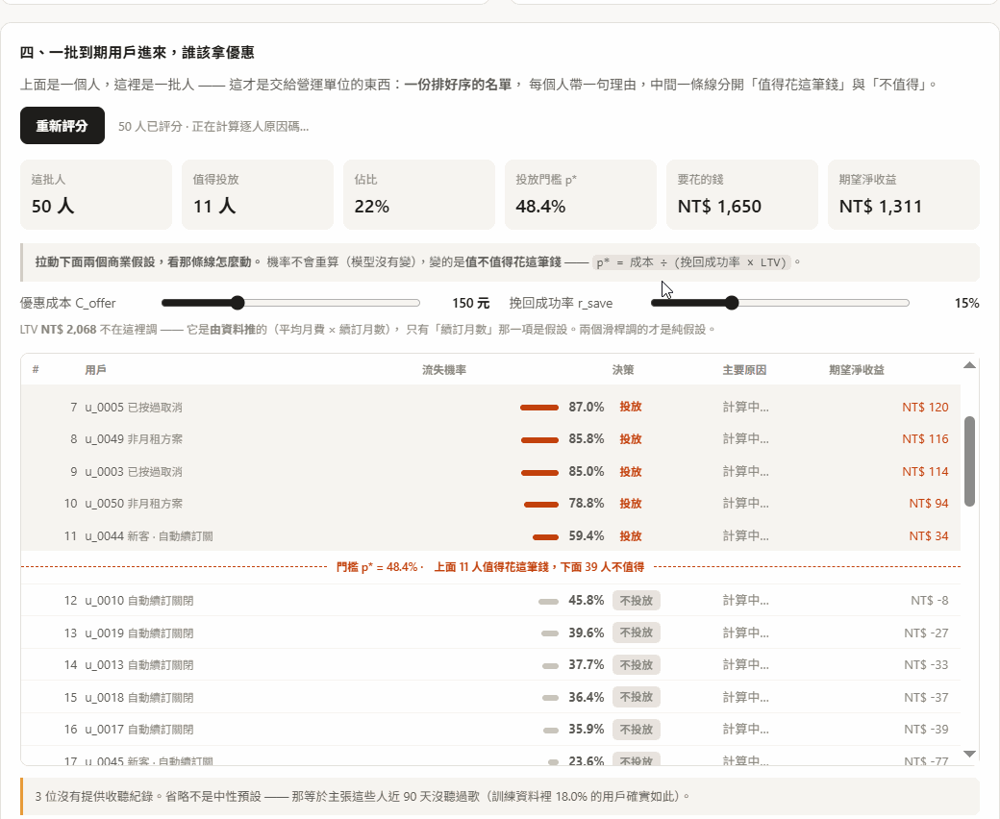
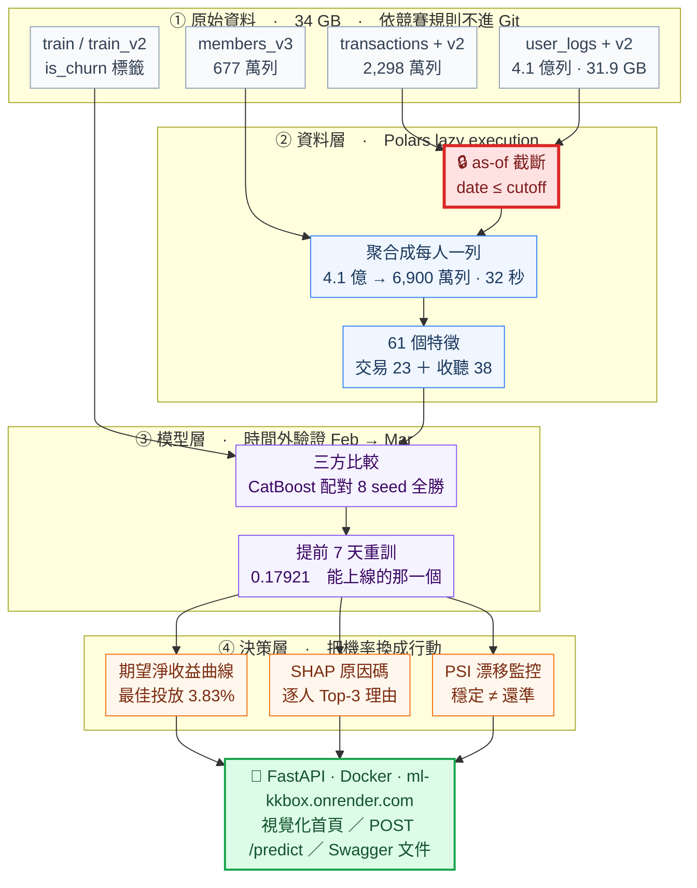

# KKBox 訂閱流失預測與挽回決策系統

> **這個月有 96.9 萬名訂閱者到期，挽回預算只夠發給一小部分人。該發給誰？**

[](https://ml-kkbox.onrender.com)

**[▶ 線上 Demo](https://ml-kkbox.onrender.com)**　·　[API 文件](https://ml-kkbox.onrender.com/docs)　·　[完整發現](FINDINGS.md)　·　[規格書](SPEC.md)　·　[模型卡](MODEL_CARD.md)

---

## 一分鐘看懂

KKBox 是台灣的音樂串流服務，每個月有一批訂閱到期，其中大約 9% 的人不會再續訂。要留住他們得花錢，例如送一個月免費，成本 150 元。

問題是不能發給所有人。大部分人本來就會續訂，優惠只是白送，全發一定虧。所以要回答的不是「誰會流失」，是「發給誰才划算」。

從 2,298 萬筆訂閱交易與 4.1 億列每日收聽日誌（30.5 GB）出發，交付三樣可以直接接上營運流程的東西：

| | 交付物 | 實測結果 |
|---|---|---|
| ① | **流失機率**　每位到期用戶一個 0~1 的分數 | 時間外 Log Loss **0.17921**，比「對所有人猜同一個數字」好 41.2% |
| ② | **投放名單**　由商業假設推導門檻，篩出值得投放的人 | 96.9 萬人裡挑 **37,174 人**（3.83%），命中率 83.3%，期望淨收益 **NT$ 330 萬** |
| ③ | **原因碼**　每個上榜的人，最多三句中文理由 | 48,853 人、145,796 句候選理由，全部可稽核 |

門檻 `p* = 成本 ÷ (挽回成功率 × LTV)` 是從三個商業假設推出來的，沒有看過任何標籤。但它落的位置離期望淨收益曲線的實測極大值只差 177 元，也就是 0.005%。

**資料集**：[WSDM – KKBox's Churn Prediction Challenge](https://www.kaggle.com/competitions/kkbox-churn-prediction-challenge)（WSDM Cup 2018）　**評分指標**：Log Loss

---

## 技術挑戰與做法

| 挑戰 | 做法 |
|---|---|
| 收聽日誌 4.1 億列、30.5 GB，pandas 直接 OOM | Polars lazy execution，日期過濾在讀取階段就 predicate pushdown 掉。收斂成每人一列：6,900 萬列、2.20 GiB、32 秒 |
| 標籤藏在資料裡。到期後 30 天的交易紀錄就是答案 | as-of 截斷，每欄特徵只由 cutoff 前已經發生的事算出。八條防洩漏紅線各有一個餵違規資料就會 raise 的測試 |
| 只切一次分不出模型強，還是這個月剛好合它胃口 | 時間外驗證 Feb→Mar、反向驗證 Mar→Feb、配對 8 seed。三家比完選 CatBoost，優勢 7.69σ、配對 8:0 |
| 挽回優惠得提前寄出才來得及 | 把評分時點拉到到期日前 7 天重訓，模型看不到當天那筆續訂或取消。時間外 Log Loss 0.17921，上線和 Demo 用的都是這一個 |
| 技術指標要能換算成錢 | `E[淨收益] = p × r_save × LTV − C_offer`。門檻 `p* = C_offer ÷ (r_save × LTV)` 不看標籤，落點離實測極大值差 177 元 |
| 名單上的每個人都要說得出為什麼在上面 | CatBoost 原生 TreeSHAP 逐人歸因，組內相加取前三，加總恆等式逐列驗 |
| 上線之後怎麼知道模型還準 | PSI 漂移監控。門檻先量過雜訊地板才定，特徵分布和基準率分開看 |
| 一個總分會蓋掉整群人 | 每次評估分三群回報。老訂戶流失率 5.87%，首次到期的新客 39.84%，差 6.8 倍 |
| 怎麼確定線上載到的是對的模型 | 模型、特徵欄序、業務假設打包成一份 artifact，載入時過三道守門：雜湊、欄位指紋、版本。存載容差 0 |

---

## 架構

從 34 GB 原始檔案到一個能回答「該投放給誰」的服務，中間四層。紅色那一格是防洩漏的核心。



紅框那個 as-of 截斷是全案最要緊的一步。標籤是「到期後 30 天內有沒有新交易」，而那 30 天的資料就在手上。任何跨越到期日的切分都會洩漏，所以每一欄特徵都只能由 cutoff 當下已經發生的事算出來。詳見 [SPEC.md §4.3](SPEC.md) 與 [§5](SPEC.md)。

---

## 專案狀態

服務已經上線，四層都做完了。下面每個數字都可以用對應的 `make` 指令重現。

| | |
|---|---|
| **資料** | 官方 10 個競賽檔案全部下載並實測，收聽日誌合計 410,502,905 列 / 31.9 GB |
| **程式** | `src/` 分成資料、特徵、模型、評估、解釋、服務六層，22 個 `scripts/` 進入點 |
| **測試** | 381 passed · 0 skipped，約 85 秒。八條防洩漏紅線各有一個守門測試 |
| **CI** | GitHub Actions 跑 ruff 和 pytest，其中 295 條不需要資料的純邏輯測試要求零 skip |
| **服務** | `POST /predict` 單人、`POST /predict/batch` 一批人，機率和原因碼都是即時算的 |
| **部署** | Docker 容器跑在 Render：視覺化首頁、API、Swagger 文件 |

---

## 快速開始

```bash
pip install uv && make setup
```

然後複製 `configs/paths.example.yaml` 成 `configs/paths.yaml`，填上這台機器的資料路徑，把 Kaggle 憑證放好：

```bash
make data && make test
```

`make help` 會列出全部 22 個目標。完整步驟見 [FINDINGS.md 的快速開始](FINDINGS.md#快速開始)，那裡有 Windows 沒裝 `make` 時的 `uv` 指令對照，以及各里程碑的耗時表。

依 Kaggle 競賽規則，原始資料不隨 repo 散布，要自己下載。

---

## 資料來源

- 資料：© KKBOX Group，依 [WSDM Cup 2018 競賽規則](https://www.kaggle.com/competitions/kkbox-churn-prediction-challenge/rules)使用，未隨本 repo 散布
- 程式碼：尚未指定授權。未附 `LICENSE` 檔，因此依著作權法預設保留一切權利，要引用或再利用請先來信。
