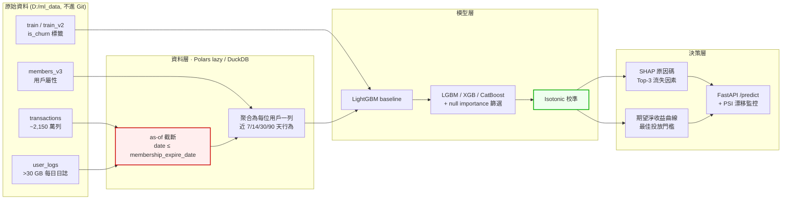

# KKBox 訂閱流失預測與挽回決策系統

> 在有限的挽回預算下，這個月該對哪一批即將到期的訂閱用戶投放資源，才能讓期望淨收益最大？

從 2,000 萬筆訂閱交易與 30 GB 每日收聽日誌中，建構一個輸出**校準機率**與**可解釋流失原因**的模型，並將其轉換為可執行的挽回名單與投放門檻。

**資料集**：[WSDM – KKBox's Churn Prediction Challenge](https://www.kaggle.com/competitions/kkbox-churn-prediction-challenge)（WSDM Cup 2018）
**指標**：Log Loss ｜ **規格書**：[SPEC.md](SPEC.md) ｜ **模型限制**：`MODEL_CARD.md`（待建立）

---

> ### 🚧 專案狀態：M0 進行中（資料契約已完成，Repo 骨架未建）
>
> 基準線為實測值。**M1 以後的模型分數尚未產生，表中為佔位符。**
> 在本橫幅移除之前，請勿將本 repo 的模型數字視為成果。

---

## 成果表

| 階段 | 模型 | 時間外驗證 Log Loss | 相對前一步 | 狀態 |
|---|---|---|---|---|
| 基準 | 常數預測（訓練集流失率 6.3923%） | **0.30746** | — | ✅ 已實測 |
| M1 | LightGBM（交易 + 用戶屬性） | — | — | ⬜ |
| M2 | ＋ 收聽行為聚合特徵 | — | — | ⬜ |
| M3 | ＋ 模型比較與特徵篩選 | — | — | ⬜ |
| M4 | ＋ 機率校準 | — | — | ⬜ |
| M6 | 部署版（提前 7 天預測） | — | — | ⬜ |

**參考錨點**（官方私榜最終成績）：🥇 0.07974 ｜ 第 10 名 0.09886 ｜ 第 20 名 0.10834

**Demo**：⬜ 尚未部署（M6 交付，將部署至 Hugging Face Spaces）

---

## 架構



紅框的 **as-of 截斷**是本專案的防洩漏核心；綠框的**機率校準**是把模型輸出換算成金額的前提。兩者的理由見 [SPEC.md §4.3](SPEC.md) 與 [§5](SPEC.md)。

---

## 這個專案在解什麼工程問題

| 挑戰 | 為什麼難 |
|---|---|
| **30 GB 日誌壓成每人一列** | pandas 直接 OOM。必須用 Polars lazy execution 或 DuckDB streaming，在 32 GB RAM 內完成聚合 |
| **標籤就藏在資料裡** | 標籤是「到期後 30 天內是否有新交易」，而 `transactions_v2` 涵蓋到 3/31。對 2 月到期的用戶，3 月的交易紀錄**就是答案**。任何跨越到期日的切分都會洩漏 |
| **官方資料集本身埋了陷阱** | `members.csv` 含快照式 `expiration_date`，官方後來發布 `members_v3.csv` 就是為了移除它。用錯檔案，CV 分數會漂亮到不真實 |
| **指標不是 accuracy 也不是 AUC** | Log Loss 同時懲罰排序錯誤與機率失準。一個 AUC 更高但過度自信的模型分數反而更差 —— 校準在本題不是加分項，是必需品 |
| **技術指標要能換算成錢** | `E[淨收益] = p_churn × r_save × LTV − C_offer`。沒有校準過的機率，這條式子算出來的金額是假的 |
| **總分會騙人** | 實測發現驗證集裡「重複出現的老訂戶」流失率 5.87%、「首次到期的新客」39.84%，**差 6.8 倍**。只報一個總 log loss 會掩蓋模型在小分群上的失效，因此每次評估都分三群回報 |

---

## 驗證策略

```
訓練  ── train.csv     (2017-02 到期 cohort)  → 觀察期 2017-03
驗證  ── train_v2.csv  (2017-03 到期 cohort)  → 觀察期 2017-04
測試  ── 官方測試集     (2017-04 到期 cohort)  → 觀察期 2017-05
```

採用**時間外驗證**：訓練→驗證（Feb→Mar）與驗證→測試（Mar→Apr）在時間結構上同構，因此驗證分數可外推至測試表現。這是唯一對應真實部署情境的切分方式。

隨機切分在本專案是**紅線**。完整的八條紅線與對應的失敗測試見 [SPEC.md §5](SPEC.md)。

---

## 快速開始

> ⚠️ 依 Kaggle 競賽規則，原始資料**不隨 repo 散布**。請依下列步驟自行下載。

### 1. 環境

```bash
make setup
```

### 2. Kaggle API 憑證

前往 [Kaggle Settings](https://www.kaggle.com/settings) → API → `Create New Token`，將 `kaggle.json` 放到 `~/.kaggle/`。

**接著務必到[競賽頁面](https://www.kaggle.com/competitions/kkbox-churn-prediction-challenge/rules)點 Late Submission 並接受規則**，否則 API 下載會回 403。

### 3. 下載資料

```bash
make data
```

資料會下載到 `D:/ml_data/`（可於 `configs/` 調整），**不會進入專案資料夾**。

### 4. 先跑 1% 抽樣確認流程

```bash
make smoke
```

### 5. 完整流程

```bash
make features && make train && make eval
```

---

## Repository 結構

```
ML_kkbox/
├── README.md                  # 你正在讀的檔案
├── SPEC.md                    # 規格書：資料契約、驗證策略、紅線清單
├── MODEL_CARD.md              # 模型用途、限制、已知偏誤、不適用情境
├── Makefile                   # setup / data / smoke / features / train / eval / serve
├── pyproject.toml             # uv 管理依賴
├── .gitignore                 # 排除 data/ models/ kaggle.json
├── configs/                   # YAML 設定，禁止硬編碼超參數
├── scripts/
│   └── download.py            # Kaggle 資料下載
├── src/
│   ├── data/                  # 下載、驗證、as-of 切分
│   ├── features/              # 特徵工程（純函式，可測試）
│   ├── models/                # 訓練與推論
│   └── serving/               # FastAPI
├── tests/
│   ├── test_data_contract.py  # 欄位、型別、筆數斷言
│   └── test_no_leakage.py     # 八條紅線的失敗測試
├── notebooks/                 # 僅 EDA，不放訓練邏輯
├── reports/figures/           # 所有圖表
└── .github/workflows/ci.yml   # ruff + pytest + 1% smoke training
```

---

## 已知限制

- 模型預測的是「**會不會**流失」，不是「投放優惠**能不能改變**他的行為」。後者需要 uplift modeling 與 A/B 實驗，本資料集不具備實驗組／對照組結構，無法回答。把預測機率當成因果效應是這類專案最常見的越界。
- 資料為 2015–2017 年的歷史快照，不反映當前市場狀況。
- KKBOX 為音樂串流平台，結論外推到影音串流或電信服務時需重新驗證。
- 完整限制清單見 `MODEL_CARD.md`（M6 交付）。

---

## 授權與致謝

- 程式碼：MIT（待加入 `LICENSE`）
- 資料：© KKBOX Group，依 [WSDM Cup 2018 競賽規則](https://www.kaggle.com/competitions/kkbox-churn-prediction-challenge/rules)使用，未隨本 repo 散布
- 本專案為 AI 應用就業養成班機器學習實作專題，題目依手冊 PART 6.5 替換條款自選
