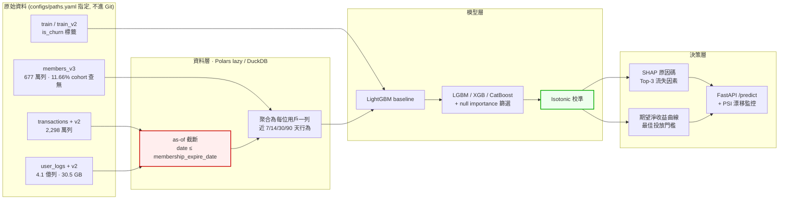

# KKBox 訂閱流失預測與挽回決策系統

> 在有限的挽回預算下，這個月該對哪一批即將到期的訂閱用戶投放資源，才能讓期望淨收益最大？

從 **2,298 萬筆**訂閱交易與 **4.1 億列**每日收聽日誌（30.5 GB）中，建構一個輸出**校準機率**與**可解釋流失原因**的模型，並將其轉換為可執行的挽回名單與投放門檻。

**資料集**：[WSDM – KKBox's Churn Prediction Challenge](https://www.kaggle.com/competitions/kkbox-churn-prediction-challenge)（WSDM Cup 2018）
**指標**：Log Loss ｜ **規格書**：[SPEC.md](SPEC.md) ｜ **模型限制**：`MODEL_CARD.md`（待建立）

---

> ### 🚧 專案狀態：M0 完成，M1 未開始
>
> 已完成：全部 10 個競賽檔案下載並實測、`src/` 基礎模組、EDA 與 8 張圖表、
> `tests/` 資料契約 12 條斷言與 4 條紅線測試（**39 passed · 4 skipped**）、
> Makefile、GitHub Actions CI。
>
> 基準線為實測值。**M1 以後的模型分數尚未產生，表中為佔位符。**
> 在本橫幅移除之前，請勿將本 repo 的模型數字視為成果。

---

## 成果表

| 階段 | 模型 | 時間外驗證 Log Loss | 相對前一步 | 狀態 |
|---|---|---|---|---|
| 基準 | 常數預測（訓練集流失率 6.3923%） | **0.30746** | — | ✅ 已實測 |
| M1 | LightGBM（交易 + 用戶屬性，23 特徵） | **0.16335** | **−46.9%** | ✅ 已實測 |
| M2 | ＋ 收聽行為聚合特徵（+38 特徵，共 61） | **0.15821** | **−3.1%** | ✅ 已實測 |
| M3 | ＋ 模型比較與特徵篩選 | — | — | ⬜ |
| M4 | ＋ 機率校準 | — | — | ⬜ |
| M6 | 部署版（提前 7 天預測） | — | — | ⬜ |

M1 的 Feb cohort 內部 5-fold：**0.08546 ± 0.00049**。與時間外分數的差距見下方「M1 的發現」。

**參考錨點**（官方私榜最終成績）：🥇 0.07974 ｜ 第 10 名 0.09886 ｜ 第 20 名 0.10834

**Demo**：⬜ 尚未部署（M6 交付，將部署至 Hugging Face Spaces）

---

## 架構



紅框的 **as-of 截斷**是本專案的防洩漏核心；綠框的**機率校準**是把模型輸出換算成金額的前提。兩者的理由見 [SPEC.md §4.3](SPEC.md) 與 [§5](SPEC.md)。

---

## 這個專案在解什麼工程問題

| 挑戰 | 為什麼難 |
|---|---|
| **4.1 億列日誌壓成每人一列** | 實測 `user_logs` 392,106,543 列（30.5 GB）+ `user_logs_v2` 18,396,362 列。pandas 直接 OOM，必須用 Polars lazy execution 或 DuckDB streaming，在 32 GB RAM 內完成聚合 |
| **標籤就藏在資料裡** | 標籤是「到期後 30 天內是否有新交易」，而 `transactions_v2` 涵蓋到 3/31。對 2 月到期的用戶，3 月的交易紀錄**就是答案**。任何跨越到期日的切分都會洩漏 |
| **官方資料集本身埋了陷阱** | `members.csv` 含快照式 `expiration_date`，官方後來發布 `members_v3.csv` 就是為了移除它。用錯檔案，CV 分數會漂亮到不真實 |
| **指標不是 accuracy 也不是 AUC** | Log Loss 同時懲罰排序錯誤與機率失準。一個 AUC 更高但過度自信的模型分數反而更差 —— 校準在本題不是加分項，是必需品 |
| **技術指標要能換算成錢** | `E[淨收益] = p_churn × r_save × LTV − C_offer`。沒有校準過的機率，這條式子算出來的金額是假的 |
| **總分會騙人** | 實測驗證集裡「重複出現的老訂戶」流失率 5.87%、「首次到期的新客」39.84%，**差 6.8 倍**。以常數預測實測，兩群的 log loss 分別是 0.2237 與 **1.1353**，而 headline 只顯示 0.3075。因此每次評估都分三群回報 |

---

## 驗證策略

```
訓練  ── train.csv     (2017-02 到期 cohort)  → 觀察期 2017-03
驗證  ── train_v2.csv  (2017-03 到期 cohort)  → 觀察期 2017-04
測試  ── 官方測試集     (2017-04 到期 cohort)  → 觀察期 2017-05
```

採用**時間外驗證**：訓練→驗證（Feb→Mar）與驗證→測試（Mar→Apr）在時間結構上同構，因此驗證分數可外推至測試表現。這是唯一對應真實部署情境的切分方式。

隨機切分在本專案是**紅線**。完整的八條紅線與對應的失敗測試見 [SPEC.md §5](SPEC.md)。

---

## M0 的發現

完整分析見 [notebooks/eda_01_overview.py](notebooks/eda_01_overview.py)，圖表於 [reports/figures/](reports/figures/)。以下數字皆為 Feb cohort（992,931 人）實測。

### 兩個旗標就切出 91.6% 的流失量

只用 cutoff 之前最後一筆交易的兩個欄位：

| 分群 | 人數 | 佔用戶 | 流失率 | 佔全部流失量 |
|---|---|---|---|---|
| **A** 最後一筆已取消 | 28,950 | 2.9% | **75.07%** | 34.2% |
| **B** 自動續訂關閉 | 111,722 | 11.3% | **32.59%** | 57.4% |
| **C** 其餘 | 852,259 | 85.8% | **0.63%** | 8.4% |


**A + B 只佔 14.2% 的用戶，卻涵蓋 91.6% 的流失量。** 給業務單位的第一句話是：挽回預算不必撒在全體。

**但這兩個旗標是 `if` 判斷，不是機器學習。** 真正的問題在 C 群那 852,259 人裡藏著的 **5,331 個流失者** —— 規則找不出他們，這才是模型要解的（[SPEC.md §4.5](SPEC.md)）。

⚠️ **A 群的 75.07% 有一個必須誠實揭露的問題**：取消常發生在到期日當天，而 cutoff 就是到期日，所以這個訊號幾乎等於答案本身。M6 要求另做 `cutoff = 到期日 − 7 天` 的版本，屆時此訊號將大幅消失，分數必然下降 —— **那個下降後的分數才是能上線的分數**。

### 缺失比數值本身更有訊號

| 欄位 | 分群 | 流失率 |
|---|---|---|
| `gender` | 男 | 8.84% |
| | 女 | 8.64% |
| | **缺失** | **4.86%** |
| `bd`（年齡） | 10–100 歲 | 8.84% |
| | **0（無效值）** | **4.76%** |

男女只差 0.2 個百分點，幾乎沒有區辨力；**「有沒有填」的差距卻是它的 20 倍**。

因此 [SPEC.md §5.1](SPEC.md) 問的「`bd` 該截斷、分箱、還是視為缺失」是問錯方向 —— 該做的是**把缺失編碼成特徵，並且不要太相信那些填了值的欄位**。

### 非月租方案是高風險族群

`payment_plan_days` 30 天佔 97.20% 的用戶，其餘 2.8% 的流失率極端：7 天 **72.70%**、395 天 **77.74%**、90 天 **57.44%**。

### 其他已量測並寫入契約測試的事實

- `user_logs` 合計 **410,502,905 列**（30.5 GB + 1.43 GB），SPEC 原本標「待測」
- `members_v3` **查不到 11.66% 的 cohort 用戶**，且該群流失率 5.02% 低於整體 —— SPEC 原文誤判為「不會有大量缺失」，已更正
- 158,766 筆交易的交易日晚於自身到期日，其中 **95.93% 是取消紀錄**（記錄慣例，非資料損壞）
- 1,218,324 筆實付 0 元，其中 **53.97% 定價本來就是 0**（免費試用），與「定價非 0 卻收 0」是兩件事

---

## M1 的發現

`make train` 產生。設定見 [configs/model_lgbm.yaml](configs/model_lgbm.yaml)，實作見 [src/models/train.py](src/models/train.py)。

### 分數穩定，但外推時掉一倍

| | log loss |
|---|---|
| Feb cohort 內部 5-fold | **0.08546 ± 0.00049** |
| **時間外（Mar cohort）** | **0.16335** |
| 差距 | **+0.07790 ＝ 160 個標準差** |

模型在 Feb 內部**極度穩定**（標準差只有 0.00049），但換到下一個月的 cohort 就掉了將近一倍。

⚠️ **這不是 bug，是概念漂移的量化。** fold 內的訓練與驗證同屬 2017-02 到期族群（流失率 6.39%），Mar cohort 是 8.99% 的另一個分布。[SPEC.md §4.2](SPEC.md)：「該差距本身就是要寫進報告的發現，不是要調掉的問題。」

**只報 fold 內的 0.085 會讓模型看起來好一倍** —— 那是這類專案最常見的自欺方式，也是為什麼本專案的 headline 數字一律用時間外分數。

### 模型系統性低估流失率

| 分群 | 人數 | 佔比 | 實際流失率 | **平均預測** | log loss |
|---|---|---|---|---|---|
| 新進用戶 | 89,259 | 9.2% | 39.84% | **26.94%** | **0.5352** |
| 重複用戶 | 881,701 | 90.8% | 5.87% | **4.45%** | 0.1257 |
| 全體 | 970,960 | 100% | 8.99% | **6.51%** | 0.1634 |

預測平均 6.51%、實際 8.99% —— 模型學到的是訓練集 Feb 的基礎流失率 6.39%。

**這直接影響業務數字**：[SPEC.md §6.1](SPEC.md) 的公式 `E[淨收益] = p_churn × r_save × LTV − C_offer` 以 `p_churn` 相乘，低估 28% 會讓投放門檻設得過於保守。**這就是 M4 機率校準要解決的問題，現在它從一句敘述變成一個可量測的偏差。**

新進用戶的 log loss 是重複用戶的 4.3 倍，而 headline 貼近重複用戶那組 —— 因為他們佔 90.8%。這是 [SPEC.md §4.5](SPEC.md) 要求分三群回報的理由。

### 三個特徵佔了 73.8% 的貢獻

| 特徵 | gain 佔比 |
|---|---|
| `last_is_cancel` | **35.4%** |
| `last_is_auto_renew` | 22.6% |
| `days_since_last_tx` | 15.9% |
| `last_payment_method_id` | 8.0% |

與 M0 的三分群發現完全一致。

⚠️ **但這代表分數高度依賴 `last_is_cancel`，而取消多半發生在到期日當天 —— 也就是 cutoff 當天。** [SPEC.md §4.3](SPEC.md) 要求 M6 另做 `cutoff = 到期日 − 7 天` 的版本，屆時這個訊號會大幅消失。**那個下降後的分數才是真正能上線的分數**，本專案會誠實回報它。

---

## M2 的發現：38 個收聽特徵只換來 3.1%

`make features && make train` 產生。實作見 [src/features/logs.py](src/features/logs.py)。

### 工程問題解決了

| | 原始 | 收斂後 |
|---|---|---|
| 列數 | 410,502,905 | **68,993,949**（16.8%） |
| 大小 | 31.9 GB | **2.20 GiB** |
| 耗時 | — | **32 秒** |

關鍵洞察是 **SPEC 要的最長窗口只有 90 天**，所以 2015 到 2016 上半年的日誌完全用不到。日期過濾在讀取階段就由 predicate pushdown 丟掉，31 GB RAM 全程沒有壓力。

反過來寫 —— 先 join 再 filter —— 需要把 4 億列的中間結果放進記憶體，那才是會 OOM 的寫法。

### 但模型分數只改善 3.1%

| | M1 | M2 | 變化 |
|---|---|---|---|
| **時間外（Mar）** | 0.16335 | **0.15821** | **−3.15%** |
| 重複用戶 | 0.12571 | 0.12084 | −3.87% |
| 新進用戶 | 0.53521 | 0.52733 | −1.47% |

38 個收聽特徵佔了 62% 的特徵數，卻只貢獻 **10.99%** 的 gain：

| 特徵來源 | 特徵數 | gain 佔比 |
|---|---|---|
| 交易與用戶屬性 | 23 | **89.01%** |
| 收聽行為 | 38 | **10.99%** |

最有貢獻的收聽特徵是 `log90_active_days`（2.72%）與 `log_min_days_before`（1.82%）。

### 為什麼？EDA 早就預告了

**活躍「水準」無法從 Feb 外推到 Mar：**

| 近 30 天活躍天數 | Feb 流失率 | Mar 流失率 |
|---|---|---|
| 0 天 | 9.23% | 10.06% |
| 6–15 天 | 6.93% | 9.40% |
| 26–30 天 | **5.38%** | **9.51%** |

**Feb 單調遞減，Mar 完全平坦。** 這個特徵在訓練集有效、在驗證集無效，模型自然學不到可外推的東西。

只有「趨勢」兩邊方向一致：

| 7天/30天 活躍趨勢 | Feb | Mar |
|---|---|---|
| < 0.25 崩跌 | **10.01%** | **12.47%** |
| > 1.25 上升 | 5.13% | 8.31% |

**「活躍度在掉」比「活躍度低」有用得多** —— 這印證了設計時選擇趨勢比值而非絕對水準的判斷。

### 兩個意料之外的觀察

**一、18.4% 的用戶 90 天內完全沒有收聽紀錄，而這件事沒有訊號。**

| | Feb 流失率 | Mar 流失率 |
|---|---|---|
| 無任何紀錄 | 6.12% | 6.80% |
| 有紀錄 | 6.45% | 9.48% |

Feb 幾乎無差異，Mar 方向甚至相反。合理解釋：這些多半是**自動續訂的休眠訂戶** —— 忘了自己有訂閱，不聽歌但錢照扣，所以不流失。

模型也同意：`log_has_logs` 這個特徵的 gain 是 **0**，一次都沒被用到。

**二、這個結果本身就是交付物。** 花了 31.9 GB 的處理只換來 3.1%，聽起來像失敗，但它回答了一個真實的業務問題：**對這個資料集而言，「有沒有付錢的意願」比「有沒有在使用」更能預測續訂。** `last_is_cancel` 與 `last_is_auto_renew` 合計 54.4% 的 gain，收聽行為全部加起來只有 11%。

### 消融實驗：確認要不要繼續投資

`make ablation` 產生（[scripts/ablation.py](scripts/ablation.py)）。七次訓練，全部以時間外 Mar 分數比較。

| 實驗 | 特徵數 | Mar log loss | 相對 M1 | 每特徵效率 |
|---|---|---|---|---|
| `txn_only`（M1 對照） | 23 | 0.16335 | — | — |
| **`log_only`（無交易特徵）** | 38 | **0.29735** | **+82.0%** | — |
| txn + **recency** | 25 | 0.16009 | −2.00% | **0.998%** |
| txn + trend | 26 | 0.16106 | −1.40% | 0.467% |
| txn + frequency | 31 | 0.16072 | −1.61% | 0.201% |
| txn + intensity | 47 | 0.15859 | −2.91% | 0.121% |
| `all`（M2 對照） | 61 | 0.15821 | −3.15% | 0.083% |

**結論一：收聽行為沒有獨立訊號。** `log_only` 是 0.29735，而「對所有人預測同一個數字」的常數基準是 0.30746 —— **38 個特徵、400 輪，只贏了 3.3%**。收聽資料單獨使用幾乎等於什麼都不知道。

**結論二：四組高度重疊。** 各組單獨貢獻相加是 7.92%，全部一起卻只有 3.15% —— **重疊掉六成**。四組其實都在量同一件事：「這個人還在不在用」。這給 M3 的 null importance 篩選一個明確動機。

**結論三：EDA 的預測是錯的，而這是最有價值的一課。**

根據 M0 的 EDA，我預期 **trend 最強**（它是唯一在兩個 cohort 方向一致的），**intensity 最弱**（它在 Mar 完全平坦）。實測**完全相反** —— trend 最弱（−1.40%），intensity 最強（−2.91%）。

原因是 EDA 看的是**單變量**流失率分箱，而模型是**在 23 個交易特徵已經存在的條件下**使用這些特徵。單變量漂亮不代表有增量貢獻，可能那份資訊交易特徵早就有了；單變量平坦也不代表沒用，它可能在條件上仍能切開。

**單變量 EDA 不能預測多變量的增量貢獻。** 要知道一組特徵值不值得，只能做消融。

### 對照排行榜

```
🥇 第 1 名   0.07974
第 20 名    0.10834
M2          0.15821   ← 仍未進入前 20
```

依消融結果，**繼續加收聽特徵的期望報酬很低**。0.158 → 0.108 的差距要靠 M3 的調參、模型比較與特徵篩選。

---

## 快速開始

> ⚠️ 依 Kaggle 競賽規則，原始資料**不隨 repo 散布**。請依下列步驟自行下載。

各步驟都有 `make` 捷徑，但 **Windows 沒有內建 `make`**。下方同時列出 `make` 與底層的 `uv` 指令，**兩者效果完全相同**，沒裝 make 就直接用 uv 那行。

Windows 若要裝 make：`winget install ezwinports.make`。列出所有目標用 `make help`。

### 1. 安裝 uv 並建立環境

```bash
pip install uv
```

```bash
make setup
```

沒有 make 就用 `uv sync`。這一步會自行取得 Python 3.12（不影響系統 Python）、建立 `.venv`、並以 editable 模式安裝本專案，`from src.config import ...` 因而在任何工作目錄都可用。

### 2. 設定資料路徑

```bash
cp configs/paths.example.yaml configs/paths.yaml
```

Windows 用 `copy configs\paths.example.yaml configs\paths.yaml`。接著編輯 `configs/paths.yaml`：

```yaml
data_root: D:/ml_data                      # 改成這台機器的實際路徑
sevenzip: C:/Program Files/7-Zip/7z.exe    # 留空則自動搜尋
```

**這個檔不進 Git**，所以每台機器各自設定，`src/`、`scripts/`、`tests/` 都不需要修改。解壓需要 [7-Zip](https://www.7-zip.org/)。

### 3. Kaggle API 憑證

前往 [Kaggle Settings](https://www.kaggle.com/settings) → API → `Create New Token`，將 `kaggle.json` 放到 `~/.kaggle/`（Windows 為 `%USERPROFILE%\.kaggle\`）。

**接著務必到[競賽頁面](https://www.kaggle.com/competitions/kkbox-churn-prediction-challenge/rules)點 Late Submission 並接受規則**，否則 API 下載會回 403。

### 4. 下載資料

先只抓 M0／M1 需要的檔案（約 1.02 GB）：

```bash
make data
```

要全部 8.95 GB（含 M2 的 `user_logs`，解壓後共約 34 GB）：

```bash
make data-all
```

沒有 make 就用 `uv run python scripts/download.py`，加 `--groups all` 抓全部。

腳本內嵌官方檔案的 byte 數契約，下載被截斷會直接報錯；下載與解壓皆可重複執行，中斷後重跑會跳過已完成的檔案。**資料一律落在 `data_root` 之下，不會進入專案資料夾。**

### 5. 驗證資料正確

```bash
make test
```

應為 **39 passed · 4 skipped**，約 30 秒（skip 的是四條依賴後續里程碑的紅線測試）。資料尚未下載時測試會 skip 而非 fail —— 剛 clone 完 repo 的人不該看到滿螢幕紅字。

`make test-fast` 跳過需掃大檔的測試；`make lint` 跑 ruff 檢查。沒有 make 時對應 `uv run pytest`、`uv run pytest -m "not slow"`、`uv run ruff check .`。

### 6. 跑 EDA

```bash
make eda
```

圖表輸出至 `reports/figures/`。在 PyCharm 中可用 `# %%` 儲存格逐段執行（Ctrl+Enter），這樣可以一段一段看結果。第一次執行需掃描 2,298 萬列交易建立 as-of 特徵表，之後讀 parquet 快取。

### 7. 後續流程

`make features / train / eval / serve` 對應 M1–M6，尚未實作 —— 執行會明確報錯並說明屬於哪個里程碑，不會安靜地什麼都不做。

---

## Repository 結構

✅ 已建立　⬜ 規劃中（於標註的里程碑建立，**不預先開空目錄**）

```
ML_kkbox/
├── ✅ README.md                  # 你正在讀的檔案
├── ✅ SPEC.md                    # 規格書：資料契約、驗證策略、紅線清單
├── ⬜ MODEL_CARD.md              # 模型用途、限制、已知偏誤 —— M6
├── ✅ Makefile                   # 常用指令索引，`make help` 列出全部
├── ✅ pyproject.toml             # uv 管理依賴，依里程碑逐步加入
├── ✅ .python-version            # 釘 Python 3.12
├── ✅ uv.lock                    # 精確版本，跨機器一致
├── ✅ .gitignore                 # 排除 /data/ /models/ kaggle.json configs/paths.yaml
├── ✅ configs/
│   ├── ✅ paths.example.yaml     # 路徑範本（進 Git）
│   └── 🚫 paths.yaml             # 機器專屬設定（不進 Git）
├── ✅ scripts/
│   └── ✅ download.py            # Kaggle 下載，內嵌 byte 數契約
├── ✅ src/
│   ├── ✅ config.py              # 路徑設定，全專案唯一來源
│   ├── ✅ data/cohort.py         # as-of 截斷（紅線 1）＋ 守門檢查
│   ├── ✅ evaluation/metrics.py  # log loss（紅線 8）＋ 分群回報
│   ├── ⬜ features/              # 收聽行為聚合 —— M2
│   ├── ⬜ models/                # 訓練與推論 —— M1
│   └── ⬜ serving/               # FastAPI —— M6
├── ✅ tests/
│   ├── ✅ conftest.py            # 共用 fixture，無資料時 skip 而非 fail
│   ├── ✅ test_data_contract.py  # SPEC §2.3 的 12 條斷言
│   └── ✅ test_no_leakage.py     # 紅線 1/3/7/8 已實作，2/4/5/6 以 skip 保留
├── ✅ notebooks/
│   └── ✅ eda_01_overview.py     # 僅 EDA，不放訓練邏輯
├── ✅ reports/figures/           # 8 張圖表
└── ✅ .github/workflows/ci.yml   # ruff + pytest（見下方 CI 的限制）
```

`src/features/`、`src/models/`、`src/serving/` 刻意尚未建立。空的套件目錄是雜訊，等到有東西要放進去時再開。

---

## CI 驗證了什麼（以及沒驗證什麼）

**CI runner 上沒有原始資料** —— 資料依競賽規則不進 Git。因此 43 條測試裡有 36 條在 CI 上會被跳過。

⚠️ **一個全部 skip 的測試套件也會顯示綠燈。** 這跟本專案 [SPEC.md §4.5](SPEC.md) 講的「總分會騙人」是同一類問題：一個看起來成功的數字，底下什麼都沒驗證。

因此 CI 把不需資料的純邏輯測試標記為 `nodata`，單獨跑一段並**要求全過且零 skip**：

| CI 實際驗證 | 內容 |
|---|---|
| **紅線 1** | as-of 截斷守門函式 —— 包含餵入違規資料確認它會 raise |
| **紅線 3** | 程式碼不得引用 `members.csv` 的靜態掃描 |
| **紅線 8** | log loss 的官方 clip 行為、與手算公式對照、錯誤輸入處理 |
| Lint | `ruff check` + 格式檢查，全 repo |

| CI **無法**驗證 | 為什麼 |
|---|---|
| 資料契約 12 條斷言 | 需要 34 GB 原始資料 |
| 紅線 7（無未來資料） | 需要建 cohort 特徵表 |
| M1 基準線 0.30746 | 同上 |

這些只能在有資料的機器上執行（`make test`）。**CI 綠燈不等於資料正確**，這個界線必須講清楚。

---

## 已知限制

- 模型預測的是「**會不會**流失」，不是「投放優惠**能不能改變**他的行為」。後者需要 uplift modeling 與 A/B 實驗，本資料集不具備實驗組／對照組結構，無法回答。把預測機率當成因果效應是這類專案最常見的越界。
- 資料為 2015–2017 年的歷史快照，不反映當前市場狀況。
- KKBOX 為音樂串流平台，結論外推到影音串流或電信服務時需重新驗證。
- 完整限制清單見 `MODEL_CARD.md`（M6 交付）。

---

## 授權與致謝

- 程式碼：MIT（待加入 `LICENSE`）
- 資料：© KKBOX Group，依 [WSDM Cup 2018 競賽規則](https://www.kaggle.com/competitions/kkbox-churn-prediction-challenge/rules)使用，未隨本 repo 散布
- 本專案為 AI 應用就業養成班機器學習實作專題，題目依手冊 PART 6.5 替換條款自選
