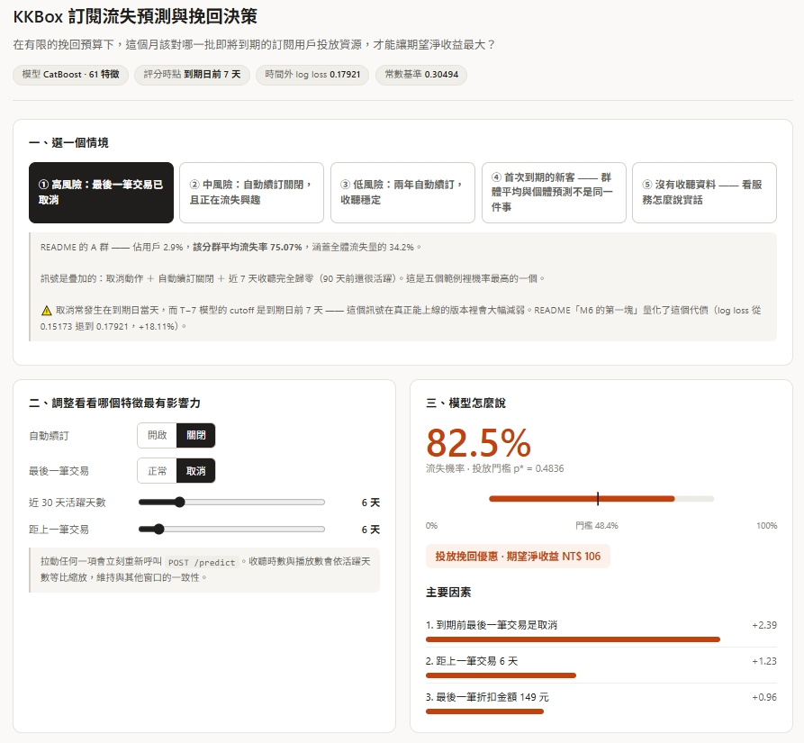
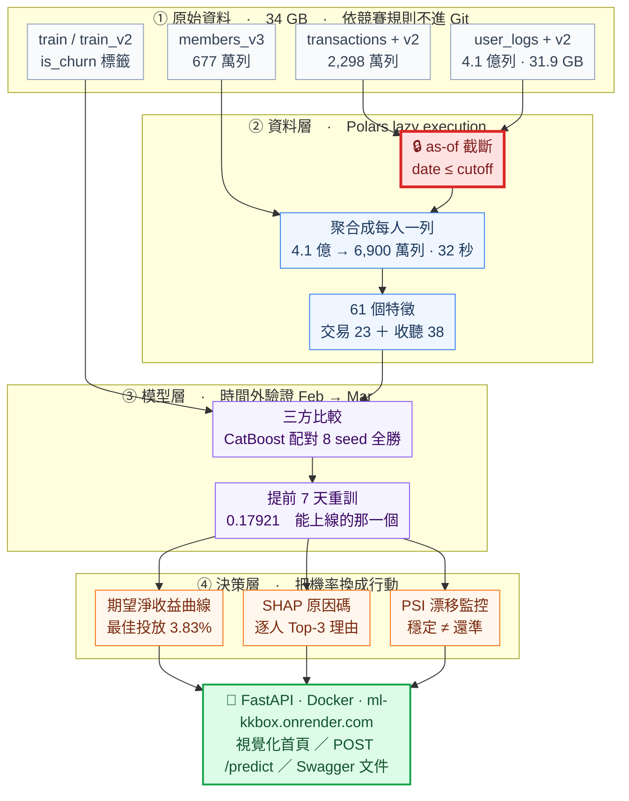

# KKBox 訂閱流失預測與挽回決策系統

> **這個月有 96.9 萬名訂閱者到期，挽回預算只夠發給一小部分人 —— 該發給誰？**

[](https://ml-kkbox.onrender.com)

**[▶ 線上 Demo](https://ml-kkbox.onrender.com)**　·　[API 文件](https://ml-kkbox.onrender.com/docs)　·　[完整發現](FINDINGS.md)　·　[規格書](SPEC.md)　·　[模型卡](MODEL_CARD.md)

---

## 一分鐘看懂

KKBox 是台灣的音樂串流服務。每個月都有一批訂閱到期，其中約 9% 的人不再續訂。挽回他們要花錢（例如送一個月免費，成本 150 元），而**發給所有人一定虧損**：大部分人本來就會續訂，優惠只是白送。所以真正的問題不是「誰會流失」，而是**「發給誰才划算」**。

本專案從 **2,298 萬筆**訂閱交易與 **4.1 億列**每日收聽日誌（30.5 GB）出發，交付三樣可以直接接上營運流程的東西：

| | 交付物 | 實測結果 |
|---|---|---|
| **①** | **流失機率** —— 每位到期用戶一個 0~1 的分數 | 時間外 Log Loss **0.17921**，比「對所有人猜同一個數字」好 **41.2%** |
| **②** | **投放名單** —— 由商業假設推導門檻 `p*`，篩出值得投放的人 | 96.9 萬人中選 **37,174 人（3.83%）**，名單命中率 **83.3%**，期望淨收益 **NT$ 330 萬** |
| **③** | **原因碼** —— 每個上榜的人，最多三句中文理由 | CatBoost 原生 TreeSHAP 逐人歸因，加總恆等式逐列驗過 |

三者由**同一份模型 artifact** 算出：線上 Demo、報告裡的數字、Kaggle 提交檔共用同一個模型檔，不是三個名字一樣的東西。

> 那條門檻 `p* = 成本 ÷ (挽回成功率 × LTV)` **沒有看過任何標籤**，純粹由三個商業假設推導。但它的落點與期望淨收益曲線的實測極大值只差 **NT$ 177（0.005%）**。

**資料集**：[WSDM – KKBox's Churn Prediction Challenge](https://www.kaggle.com/competitions/kkbox-churn-prediction-challenge)（WSDM Cup 2018）　**評分指標**：Log Loss

---

## 方法與它解決的問題

每一列都是一個真實遇到的工程或建模問題、實際採用的方法，以及量出來的結果。

| 遇到的問題 | 用的方法 | 實測結果 |
|---|---|---|
| **4.1 億列收聽日誌（30.5 GB）**，pandas 直接 OOM | Polars lazy execution，日期過濾在讀取階段就由 predicate pushdown 丟掉 | 4.1 億 → 6,900 萬列，**32 秒**，2.20 GiB，32 GB RAM 全程無壓力 |
| **標籤就藏在資料裡** —— 到期後 30 天的交易紀錄就是答案，任何跨越到期日的切分都會洩漏 | as-of 截斷：每一欄特徵只由 cutoff 當下已經發生的事算出；八條紅線各有一個「餵違規資料會 raise」的守門測試 | **381 條測試 · 0 skipped**，八條紅線全部有守門 |
| **分數是好是壞，分不清是模型的本事還是這個月剛好合它胃口** | 時間外驗證（Feb→Mar）＋ 反向驗證（Mar→Feb）＋ 配對 8 seed | CatBoost 的優勢 **7.69σ**，配對 **8:0** 全勝 |
| 該用哪一個模型 | LightGBM / XGBoost / CatBoost 三方比較，相同特徵、相同切分、相同 early stopping，三家皆未調參 | CatBoost **0.15367**，比 LightGBM 好 **2.16%**；優勢集中在交易史短的新客 |
| **挽回優惠必須提前寄出才來得及**，到期日當天評分的模型無法上線 | `cutoff = 到期日 − 7 天` 重訓，讓模型看不到到期日當天那筆續訂或取消 | **0.17921** —— 上線用的、Demo 上跑的都是這一個 |
| **技術指標要能換算成錢** | `E[淨收益] = p × r_save × LTV − C_offer`，投放門檻 `p* = C_offer ÷ (r_save × LTV)` 純由商業假設推導，不看標籤 | p* 的落點與期望淨收益曲線的實測極大值只差 **NT$ 177（0.005%）** |
| **名單上的每個人都要能解釋為什麼在上面** | CatBoost 原生 TreeSHAP 逐人歸因，組內相加取前三，加總恆等式逐列驗 | 48,853 人、145,796 句候選理由，每一句可稽核 |
| **上線之後怎麼知道模型還準** | PSI 漂移監控，門檻先量過雜訊地板才定；特徵分布與基準率分開監控 | 每次評分附帶漂移報告與圖表 |
| **部署後怎麼確定載到的是對的模型** | 模型、特徵欄序、業務假設打包成單一 artifact，三道載入守門（雜湊、欄位指紋、版本） | 存載容差 **0**，Docker 容器上線於 Render |

**總分會騙人，所以每次評估都分三群回報。** 實測驗證集裡「重複出現的老訂戶」流失率 5.87%、「首次到期的新客」39.84%，**差 6.8 倍** —— 只看一個總分會把後者的問題完全蓋掉。

---

## 架構

從 34 GB 原始檔案到一個可以回答「該投放給誰」的服務，中間有四層。**紅色那一格是全案的防洩漏核心**。



**🔒 紅框的 as-of 截斷**是本專案的防洩漏核心：標籤是「到期後 30 天內有沒有新交易」，而資料裡就有那 30 天。任何跨越到期日的切分都會洩漏，所以每一欄特徵都必須只由 cutoff 當下已經發生的事算出來。理由見 [SPEC.md §4.3](SPEC.md) 與 [§5](SPEC.md)。

---

## 專案狀態

**服務已上線。** 從原始資料到線上服務，四層全部完成，下面每個數字都可以用對應的 `make` 指令重現。

| | 內容 |
|---|---|
| **資料** | 官方 10 個競賽檔案全部下載並實測；收聽日誌合計 410,502,905 列 / 31.9 GB |
| **程式** | `src/` 分資料／特徵／模型／評估／解釋／服務六層，22 個 `scripts/` 進入點 |
| **測試** | **381 passed · 0 skipped**（約 85 秒）；八條防洩漏紅線各有一個守門測試 |
| **CI** | GitHub Actions：ruff ＋ pytest，其中 295 條不需資料的純邏輯測試要求**零 skip** |
| **服務** | `POST /predict` 單人、`POST /predict/batch` 一批人，皆即時計算機率與原因碼 |
| **部署** | Docker 容器上線於 Render：視覺化首頁 ＋ API ＋ Swagger 文件 |

---

## 快速開始

```bash
pip install uv && make setup
```

接著把 `configs/paths.example.yaml` 複製成 `configs/paths.yaml` 設定本機資料路徑、放好 Kaggle 憑證，然後：

```bash
make data && make test
```

`make help` 列出全部 22 個目標。**完整步驟**（含 Windows 沒有 `make` 時的 `uv` 指令對照、以及各里程碑的耗時表）見 [FINDINGS.md 的快速開始](FINDINGS.md#快速開始)。

> ⚠️ 依 Kaggle 競賽規則，原始資料**不隨 repo 散布**，需自行下載。

---

## 資料來源

- 資料：© KKBOX Group，依 [WSDM Cup 2018 競賽規則](https://www.kaggle.com/competitions/kkbox-churn-prediction-challenge/rules)使用，**未隨本 repo 散布**
- 程式碼：尚未指定授權 —— 未附 `LICENSE` 檔，因此依著作權法預設保留一切權利。要引用或再利用請先來信。
