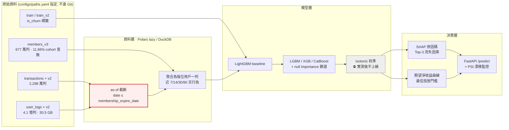
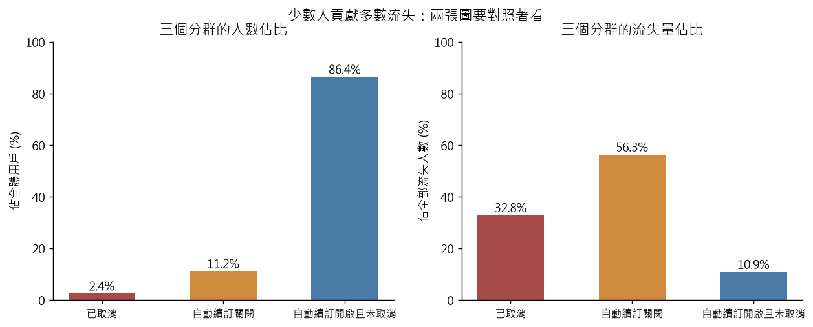

# KKBox 訂閱流失預測與挽回決策系統

> 在有限的挽回預算下，這個月該對哪一批即將到期的訂閱用戶投放資源，才能讓期望淨收益最大？

從 **2,298 萬筆**訂閱交易與 **4.1 億列**每日收聽日誌（30.5 GB）中，建構一個輸出**流失機率**與**可解釋流失原因**的模型，並將其轉換為可執行的挽回名單與投放門檻。

> 機率的**校準**原本列為交付項目之一。M4 實測後撤下：模型在自己月份上校準得幾乎完美，跨月的低估來自基準率漂移，校準器修不掉它，套上去反而更差。取而代之的是把偏差的**方向與幅度**標註清楚。見下方「M4 的發現」。

**資料集**：[WSDM – KKBox's Churn Prediction Challenge](https://www.kaggle.com/competitions/kkbox-churn-prediction-challenge)（WSDM Cup 2018）
**指標**：Log Loss ｜ **規格書**：[SPEC.md](SPEC.md) ｜ **模型限制**：`MODEL_CARD.md`（待建立）

---

> ### 🚧 專案狀態：M0–M3 完成，M4 進行中（校準已結案，業務指標待做）
>
> 已完成：全部 10 個競賽檔案下載並實測、`src/` 全部資料／特徵／模型模組、
> EDA 與 8 張圖表、M1 baseline、M2 收聽特徵聚合、M3 四個實驗、
> 一次獨立洩漏審查（7 個問題全數修正）、
> 一次反向時間外驗證、一次列順序不決定性的修正（兩者都改變過 M3 的結論）、
> **M4 校準診斷 + isotonic 校準器（實測結論：不上線，見下方）**、
> **兩次獨立洩漏審查（7 + 6 個問題全數修正）**、
> 測試 **119 passed · 1 skipped**（僅紅線 4 待 M6）、Makefile、GitHub Actions CI。
>
> **表中 M0–M3 的分數全部為實測值**，每一個都可用對應的 `make` 指令重現。
> M6 尚未產生，標為 ⬜。
>
> ⚠️ **本專案的 headline 一律是時間外（Mar cohort）分數**，不是 fold 內分數 ——
> 後者會讓模型看起來好一倍。理由見下方「M1 的發現」。

---

## 成果表

| 階段 | 模型 | 時間外驗證 Log Loss | 相對前一步 | 狀態 |
|---|---|---|---|---|
| 基準 | 常數預測（訓練集流失率 6.3923%） | **0.30746** | — | ✅ 已實測 |
| M1 | LightGBM（交易 + 用戶屬性，23 特徵） | **0.16299** | **−47.0%** | ✅ 已實測 |
| M2 | ＋ 收聽行為聚合特徵（+38 特徵，共 61） | **0.15821** | **−2.9%** | ✅ 已實測 |
| M3 | **CatBoost**（四個實驗只有換套件通過驗證） | **0.15685** | **−0.9%** | ✅ 已實測 |
| M4 | ＋ isotonic 機率校準 | **0.16859**（未校準同源 0.15854） | **+6.3%** | ⛔ **實測後決定不上線**，見下方「M4 的發現」 |
| M6 | 部署版（提前 7 天預測） | — | — | ⬜ |

M2 的 Feb cohort 內部 5-fold：**0.08563 ± 0.00031**。與時間外分數的差距見下方「M1 的發現」。

⚠️ **M1–M4 的分數重測過兩次**：2026-08-08 修掉「cutoff 自己來自未來」的洩漏，2026-08-09 修掉「cohort 列順序不固定」導致分數不可重現的問題（見下方兩節）。舊數字全部作廢。

**參考錨點**（官方私榜最終成績）：🥇 0.07974 ｜ 第 10 名 0.09886 ｜ 第 20 名 0.10834

**Demo**：⬜ 尚未部署（M6 交付，將部署至 Hugging Face Spaces）

---

## 架構



紅框的 **as-of 截斷**是本專案的防洩漏核心，理由見 [SPEC.md §4.3](SPEC.md) 與 [§5](SPEC.md)。

灰框的**機率校準**原本是把模型輸出換算成金額的前提，**M4 實測後撤下** —— 校準器已實作並量測完畢（`make calibrate-fit`），結論是套上去讓每一項指標都變差，因此流程實際走的是 `CMP → SHAP / ROI`。保留在圖上是因為「為什麼不校準」需要有地方解釋；見下方「M4 的發現」與 [SPEC.md §7.10](SPEC.md)。

---

## 這個專案在解什麼工程問題

| 挑戰 | 為什麼難 |
|---|---|
| **4.1 億列日誌壓成每人一列** | 實測 `user_logs` 392,106,543 列（30.5 GB）+ `user_logs_v2` 18,396,362 列。pandas 直接 OOM，必須用 Polars lazy execution 或 DuckDB streaming，在 32 GB RAM 內完成聚合 |
| **標籤就藏在資料裡** | 標籤是「到期後 30 天內是否有新交易」，而 `transactions_v2` 涵蓋到 3/31。對 2 月到期的用戶，3 月的交易紀錄**就是答案**。任何跨越到期日的切分都會洩漏 |
| **官方資料集本身埋了陷阱** | `members.csv` 含快照式 `expiration_date`，官方後來發布 `members_v3.csv` 就是為了移除它。用錯檔案，CV 分數會漂亮到不真實 |
| **指標不是 accuracy 也不是 AUC** | Log Loss 同時懲罰排序錯誤與機率失準。一個 AUC 更高但過度自信的模型分數反而更差 —— 校準在本題不是加分項，是必需品 |
| **技術指標要能換算成錢** | `E[淨收益] = p_churn × r_save × LTV − C_offer`。沒有校準過的機率，這條式子算出來的金額是假的 —— 而 M4 實測發現，**本專案的資料無法提供校準所需的條件**（見「M4 的發現」），因此改為把偏差的方向與幅度標註清楚 |
| **總分會騙人** | 實測驗證集裡「重複出現的老訂戶」流失率 5.87%、「首次到期的新客」39.84%，**差 6.8 倍**。以常數預測實測，兩群的 log loss 分別是 0.2237 與 **1.1353**，而 headline 只顯示 0.3075。因此每次評估都分三群回報 |

---

## 驗證策略

```
訓練  ── train.csv     (2017-02 到期 cohort)  → 觀察期 2017-03
驗證  ── train_v2.csv  (2017-03 到期 cohort)  → 觀察期 2017-04
測試  ── 官方測試集     (2017-04 到期 cohort)  → 觀察期 2017-05
```

採用**時間外驗證**：訓練→驗證（Feb→Mar）與驗證→測試（Mar→Apr）在時間結構上同構，因此驗證分數可外推至測試表現。這是唯一對應真實部署情境的切分方式。

隨機切分在本專案是**紅線**。完整的八條紅線與對應的失敗測試見 [SPEC.md §5](SPEC.md)。

---

## M0 的發現

完整分析見 [notebooks/eda_01_overview.py](notebooks/eda_01_overview.py)，圖表於 [reports/figures/](reports/figures/)。以下數字皆為 Feb cohort（992,912 人）實測。

### 兩個旗標就切出 91.6% 的流失量

只用 cutoff 之前最後一筆交易的兩個欄位：

| 分群 | 人數 | 佔用戶 | 流失率 | 佔全部流失量 |
|---|---|---|---|---|
| **A** 最後一筆已取消 | 28,950 | 2.9% | **75.07%** | 34.2% |
| **B** 自動續訂關閉 | 111,722 | 11.3% | **32.59%** | 57.4% |
| **C** 其餘 | 852,259 | 85.8% | **0.63%** | 8.4% |



**A + B 只佔 14.2% 的用戶，卻涵蓋 91.6% 的流失量。** 給業務單位的第一句話是：挽回預算不必撒在全體。

**但這兩個旗標是 `if` 判斷，不是機器學習。** 真正的問題在 C 群那 852,259 人裡藏著的 **5,331 個流失者** —— 規則找不出他們，這才是模型要解的（[SPEC.md §4.5](SPEC.md)）。

⚠️ **A 群的 75.07% 有一個必須誠實揭露的問題**：取消常發生在到期日當天，而 cutoff 就是到期日，所以這個訊號幾乎等於答案本身。M6 要求另做 `cutoff = 到期日 − 7 天` 的版本，屆時此訊號將大幅消失，分數必然下降 —— **那個下降後的分數才是能上線的分數**。

### 缺失比數值本身更有訊號

| 欄位 | 分群 | 流失率 |
|---|---|---|
| `gender` | 男 | 8.84% |
| | 女 | 8.64% |
| | **缺失** | **4.86%** |
| `bd`（年齡） | 10–100 歲 | 8.84% |
| | **0（無效值）** | **4.76%** |

男女只差 0.2 個百分點，幾乎沒有區辨力；**「有沒有填」的差距卻是它的 20 倍**。

因此 [SPEC.md §5.1](SPEC.md) 問的「`bd` 該截斷、分箱、還是視為缺失」是問錯方向 —— 該做的是**把缺失編碼成特徵，並且不要太相信那些填了值的欄位**。

### 非月租方案是高風險族群

`payment_plan_days` 30 天佔 97.20% 的用戶，其餘 2.8% 的流失率極端：7 天 **72.70%**、395 天 **77.74%**、90 天 **57.44%**。

### 其他已量測並寫入契約測試的事實

- `user_logs` 合計 **410,502,905 列**（30.5 GB + 1.43 GB），SPEC 原本標「待測」
- `members_v3` **查不到 11.66% 的 cohort 用戶**，且該群流失率 5.02% 低於整體 —— SPEC 原文誤判為「不會有大量缺失」，已更正
- 158,766 筆交易的交易日晚於自身到期日，其中 **95.93% 是取消紀錄**（記錄慣例，非資料損壞）
- 1,218,324 筆實付 0 元，其中 **53.97% 定價本來就是 0**（免費試用），與「定價非 0 卻收 0」是兩件事

---

## M1 的發現

`make train` 產生。設定見 [configs/model_lgbm.yaml](configs/model_lgbm.yaml)，實作見 [src/models/train.py](src/models/train.py)。

### 分數穩定，但外推時掉一倍

| | log loss |
|---|---|
| Feb cohort 內部 5-fold | **0.08563 ± 0.00031** |
| **時間外（Mar cohort）** | **0.16299** |
| 差距 | **+0.07736 ＝ 250 個標準差** |

模型在 Feb 內部**極度穩定**（標準差只有 0.00031），但換到下一個月的 cohort 就掉了將近一倍。

⚠️ **這不是 bug，是概念漂移的量化。** fold 內的訓練與驗證同屬 2017-02 到期族群（流失率 6.39%），Mar cohort 是 8.99% 的另一個分布。[SPEC.md §4.2](SPEC.md)：「該差距本身就是要寫進報告的發現，不是要調掉的問題。」

**只報 fold 內的 0.085 會讓模型看起來好一倍** —— 那是這類專案最常見的自欺方式，也是為什麼本專案的 headline 數字一律用時間外分數。

### 模型系統性低估流失率

| 分群 | 人數 | 佔比 | 實際流失率 | **平均預測** | log loss |
|---|---|---|---|---|---|
| 新進用戶 | 89,266 | 9.2% | 39.84% | **26.85%** | **0.5352** |
| 重複用戶 | 881,693 | 90.8% | 5.87% | **4.45%** | 0.1253 |
| 全體 | 970,959 | 100% | 8.99% | **6.51%** | 0.1630 |

預測平均 6.51%、實際 8.99% —— 模型學到的是訓練集 Feb 的基礎流失率 6.39%。

**這直接影響業務數字**：[SPEC.md §6.1](SPEC.md) 的公式 `E[淨收益] = p_churn × r_save × LTV − C_offer` 以 `p_churn` 相乘，低估 28% 會讓投放門檻設得過於保守。

⚠️ **這一段原本寫著「這就是 M4 機率校準要解決的問題」—— M4 做完之後知道那句話是錯的。** 低估是真的，但它不是校準器修得掉的那一種：模型在自己月份的乾淨保留集上校準得幾乎完美（ECE 0.00037），低估全部來自 Feb → Mar 的基準率漂移。見下方「M4 的發現」。

新進用戶的 log loss 是重複用戶的 4.3 倍，而 headline 貼近重複用戶那組 —— 因為他們佔 90.8%。這是 [SPEC.md §4.5](SPEC.md) 要求分三群回報的理由。

### 三個特徵佔了 73.3% 的貢獻

| 特徵 | gain 佔比 |
|---|---|
| `last_is_cancel` | **35.2%** |
| `last_is_auto_renew` | 22.6% |
| `days_since_last_tx` | 15.5% |
| `last_payment_method_id` | 8.6% |

與 M0 的三分群發現完全一致。

⚠️ **但這代表分數高度依賴 `last_is_cancel`，而取消多半發生在到期日當天 —— 也就是 cutoff 當天。** [SPEC.md §4.3](SPEC.md) 要求 M6 另做 `cutoff = 到期日 − 7 天` 的版本，屆時這個訊號會大幅消失。**那個下降後的分數才是真正能上線的分數**，本專案會誠實回報它。

---

## M2 的發現：38 個收聽特徵只換來 2.9%

`make features && make train` 產生。實作見 [src/features/logs.py](src/features/logs.py)。

### 工程問題解決了

| | 原始 | 收斂後 |
|---|---|---|
| 列數 | 410,502,905 | **68,993,949**（16.8%） |
| 大小 | 31.9 GB | **2.20 GiB** |
| 耗時 | — | **32 秒** |

關鍵洞察是 **SPEC 要的最長窗口只有 90 天**，所以 2015 到 2016 上半年的日誌完全用不到。日期過濾在讀取階段就由 predicate pushdown 丟掉，31 GB RAM 全程沒有壓力。

反過來寫 —— 先 join 再 filter —— 需要把 4 億列的中間結果放進記憶體，那才是會 OOM 的寫法。

### 但模型分數只改善 2.9%

| | M1 | M2 | 變化 |
|---|---|---|---|
| **時間外（Mar）** | 0.16299 | **0.15821** | **−2.93%** |
| 重複用戶 | 0.12530 | 0.12060 | −3.75% |
| 新進用戶 | 0.53517 | 0.52967 | −1.03% |

38 個收聽特徵佔了 62% 的特徵數，卻只貢獻 **10.99%** 的 gain：

| 特徵來源 | 特徵數 | gain 佔比 |
|---|---|---|
| 交易與用戶屬性 | 23 | **89.01%** |
| 收聽行為 | 38 | **10.99%** |

最有貢獻的收聽特徵是 `log90_active_days`（2.72%）與 `log_min_days_before`（1.82%）。

### 為什麼？EDA 早就預告了

**活躍「水準」無法從 Feb 外推到 Mar：**

| 近 30 天活躍天數 | Feb 流失率 | Mar 流失率 |
|---|---|---|
| 0 天 | 9.23% | 10.06% |
| 6–15 天 | 6.93% | 9.40% |
| 26–30 天 | **5.38%** | **9.51%** |

**Feb 單調遞減，Mar 完全平坦。** 這個特徵在訓練集有效、在驗證集無效，模型自然學不到可外推的東西。

只有「趨勢」兩邊方向一致：

| 7天/30天 活躍趨勢 | Feb | Mar |
|---|---|---|
| < 0.25 崩跌 | **10.01%** | **12.47%** |
| > 1.25 上升 | 5.13% | 8.31% |

**「活躍度在掉」比「活躍度低」有用得多** —— 這印證了設計時選擇趨勢比值而非絕對水準的判斷。

### 兩個意料之外的觀察

**一、18.4% 的用戶 90 天內完全沒有收聽紀錄，而這件事沒有訊號。**

| | Feb 流失率 | Mar 流失率 |
|---|---|---|
| 無任何紀錄 | 6.12% | 6.80% |
| 有紀錄 | 6.45% | 9.48% |

Feb 幾乎無差異，Mar 方向甚至相反。合理解釋：這些多半是**自動續訂的休眠訂戶** —— 忘了自己有訂閱，不聽歌但錢照扣，所以不流失。

模型也同意：`log_has_logs` 這個特徵的 gain 是 **0**，一次都沒被用到。

**二、這個結果本身就是交付物。** 花了 31.9 GB 的處理只換來 3.1%，聽起來像失敗，但它回答了一個真實的業務問題：**對這個資料集而言，「有沒有付錢的意願」比「有沒有在使用」更能預測續訂。** `last_is_cancel` 與 `last_is_auto_renew` 合計 54.4% 的 gain，收聽行為全部加起來只有 11%。

### 消融實驗：確認要不要繼續投資

`make ablation` 產生（[scripts/ablation.py](scripts/ablation.py)）。七次訓練，全部以時間外 Mar 分數比較。

| 實驗 | 特徵數 | Mar log loss | 相對 M1 | 每特徵效率 |
|---|---|---|---|---|
| `txn_only`（M1 對照） | 23 | 0.16299 | — | — |
| **`log_only`（無交易特徵）** | 38 | **0.29724** | **+82.4%** | — |
| txn + recency | 25 | 0.16008 | −1.79% | 0.894% |
| txn + **recency** | 25 | 0.16008 | −1.79% | **0.894%** |
| txn + frequency | 31 | 0.16039 | −1.60% | 0.199% |
| txn + intensity | 47 | 0.15768 | −3.26% | 0.136% |
| `all`（M2 對照） | 61 | 0.15821 | −2.93% | 0.077% |

**結論一：收聽行為沒有獨立訊號。** `log_only` 是 0.29724，而「對所有人預測同一個數字」的常數基準是 0.30746 —— **38 個特徵、400 輪，只贏了 3.3%**。收聽資料單獨使用幾乎等於什麼都不知道。

**結論二：四組高度重疊。** 各組單獨貢獻相加是 8.25%，全部一起卻只有 2.93% —— **重疊掉三分之二**。四組其實都在量同一件事：「這個人還在不在用」。這給 M3 的 null importance 篩選一個明確動機。

**結論三：EDA 的預測是錯的，而這是最有價值的一課。**

根據 M0 的 EDA，我預期 **trend 最強**（它是唯一在兩個 cohort 方向一致的），**intensity 最弱**（它在 Mar 完全平坦）。實測**完全相反** —— intensity 最強（−3.26%），trend 反而與 frequency 並列最弱（−1.60%）。

原因是 EDA 看的是**單變量**流失率分箱，而模型是**在 23 個交易特徵已經存在的條件下**使用這些特徵。單變量漂亮不代表有增量貢獻，可能那份資訊交易特徵早就有了；單變量平坦也不代表沒用，它可能在條件上仍能切開。

**單變量 EDA 不能預測多變量的增量貢獻。** 要知道一組特徵值不值得，只能做消融。

### 對照排行榜

```
🥇 第 1 名   0.07974
第 20 名    0.10834
M2          0.15821
```

依消融結果，**繼續加收聽特徵的期望報酬很低**。0.158 → 0.108 的差距要靠 M3 的調參、模型比較與特徵篩選。

> **M3 之後的更正**：這個對照本身是錯的。0.10834 是官方**私榜**成績，算在 **Apr cohort** 上；本專案的 0.158 算在 **Mar cohort** 上 —— 不同的資料集，直接比大小沒有意義。要得到可比的數字，必須對 Apr cohort 產生預測並提交 Kaggle late submission，那需要 M6 的推論管線。詳見下方「M3 的發現」與 [SPEC.md §7.4](SPEC.md)。

---

## M3 的發現：四個實驗，只有換套件站得住

M3 問的是「還有多少分數可以從建模這一側榨出來」。四個實驗、約 130 次訓練，答案是 **不到 1%**。

⚠️ 這一節的結論**改過一次**。在修掉「cohort 列順序不固定」（見最下方）之前，CatBoost 的優勢被判為不可信——**雜訊底線估錯，把一個真實效果誤判成雜訊**。

| 實驗 | 指令 | 最佳 Mar log loss | 相對自身基準 |
|---|---|---|---|
| **三方模型比較** | `make compare` | **0.15685**（CatBoost） | **−0.86%**　✅ 雙向驗證通過 |
| Target encoding 對照 | `make encode` | 0.15734（OOF TE） | −0.55%　⚠️ 單次量測 |
| Null importance 特徵篩選 | `make select` | 0.15960 | **+0.78%（變差）** |
| 超參數隨機搜尋 | `make tune` | 0.15733 | −0.65%　⚠️ 修正前符號相反 |

對照組：M1 光是加上交易特徵就是 **−47.0%**。

### CatBoost 勝出，而且雙向驗證通過

| 模型 | 輪數 | Mar log loss | 重複用戶 | 新進用戶 | 秒 |
|---|---|---|---|---|---|
| **CatBoost** | 1812 | **0.15685** | 0.11993 | **0.52159** | 284 |
| 三者平均 | — | 0.15696 | 0.12001 | 0.52189 | — |
| LightGBM | 604 | 0.15821 | 0.12060 | 0.52967 | **13** |
| XGBoost | 495 | 0.15949 | 0.12175 | 0.53227 | 31 |

三家拿到**完全相同**的 61 個特徵、相同的切分、相同的 early stopping 驗證集（[src/models/compare.py](src/models/compare.py)），三家皆未調參。

**CatBoost 的優勢集中在新進用戶**（贏 LightGBM 1.53%，重複用戶只贏 0.56%）。那群人交易史短、類別特徵的相對權重高，而 CatBoost 的原生類別處理正是為此設計的。

**這個 0.86% 通過了反向驗證**（見下一節）：兩個方向都超過 2σ。**最終採用 CatBoost**，但它慢 22 倍（284 秒 vs 13 秒）——那是一個知道差距是真的之後的成本取捨。

**集成沒有贏過最好的單一模型**：三者平均優於 LightGBM，仍差 CatBoost 0.1%。三家的特徵重要度前四名完全一致，錯誤高度相關，等權平均只是把 CatBoost 的優勢稀釋掉。

### 39% 的特徵贏不過雜訊 —— 但砍掉它們在 Mar 上變差

把標籤整欄打亂重訓 20 次，得到每個特徵「完全沒有訊號時能拿到多少 gain」的分布，再讓真實 gain 跟**自己的**分布比（[src/models/selection.py](src/models/selection.py)）。

61 個特徵裡 **24 個連自己的 null 分布都贏不過**，其中 22 個是收聽特徵，`log_has_logs` 一次都沒被用到。**M2 說的「多數很可能是雜訊」被證實了。**

門檻在 **Feb 內部**選（Feb 切成 train/es/sel 三塊），凍結後才看 Mar：

| 門檻 | 特徵數 | Feb-sel | **Mar** |
|---|---|---|---|
| 全特徵 | 61 | 0.08057 | **0.15836** |
| > null p95（凍結） | 36 | **0.08023** | **0.15960** |
| | | −0.42% | **+0.78%** |

**Feb 內部改善 0.42%，時間外退步 0.78%。方向相反，而且兩次重測都是這個方向。**

被砍掉的 25 個裡有 22 個是收聽特徵 —— 而 M2 的消融已經測到收聽特徵在 Mar 上確實有 2.93% 的貢獻。「在 Feb 內部贏不過自己的雜訊」與「在 Mar 上沒用」是兩件事。

**結論：61 個特徵全留。** 若 M6 為了推論成本要砍到 36 個，代價是 +0.78%，那是工程取捨不是模型取捨。

### 紅線 6 的完整示範：同一個錯誤，代價差 8 倍

[src/features/encoding.py](src/features/encoding.py) 實作 out-of-fold target encoding。`make encode` 跑五個變體，其中**三個是刻意寫錯的控制組**：

| 變體 | Feb 內部 | Mar 時間外 |
|---|---|---|
| A 原生類別（對照） | 0.08093 | 0.15821 |
| **B OOF TE · `last_payment_method_id`** | 0.08108 | **0.15734** |
| C Naive TE · `last_payment_method_id` ⚠️ | 0.08097 | 0.15803 |
| D Naive TE · `msno`（切分後）⚠️ | 0.22137 | 0.28467 |
| **E Naive TE · `msno`（切分前）⚠️** | **0.00000** | **1.33297** |

**E 是教科書等級的災難**：先對整個訓練 cohort 做編碼、之後才切驗證集，內部 log loss 完美到 0.00000，時間外 1.33297 —— 比「對所有人猜同一個機率」的 0.30746 還差 4.3 倍。

**C 才是最有價值的發現：同樣的違規在低基數欄位上量不出來。** `last_payment_method_id` 只有 33 種取值、每種平均兩萬多列，自己那一列的標籤只佔 1/24000，分數與合規的 B 只差 0.00069（0.15803 vs 0.15734，1.4σ）。

**所以紅線的門檻必須訂在「作法」而不是「分數有沒有變差」** —— 靠看分數抓不到 C，而同一段程式碼換到高基數欄位就是 E。

### 調參：符號在兩次重測之間翻轉過

31 次訓練、9 維隨機搜尋（[configs/tuning.yaml](configs/tuning.yaml)）。**Feb 切成三塊**，Mar 全程不參與搜尋、只在最後看一次：

```
train (70%)  訓練
es    (15%)  early stopping —— 決定停在第幾輪
sel   (15%)  選超參數 —— 決定用哪一組參數
```

| | sel（Feb 內部） | Mar（時間外） |
|---|---|---|
| 基準設定（M1/M2） | 0.08057 | 0.15836 |
| 最佳 trial | **0.08000** | **0.15733** |
| 變化 | −0.71%（改善） | **−0.65%（改善，2.1σ）** |

**⚠️ 這個結果在列順序修正之前是相反的**（當時量到 Mar 退步 0.99%）。兩次都只有單一 split，而一個會翻轉符號的效果不能當結論。

**結論：暫不採用**，需照「方案變動特徵」那節的多 seed 協定重測。搜尋結果保留在 `best_params.yaml` 供追溯。

### 結論：分界線是「有沒有在訓練集內部做選擇」

| 實驗 | 判定 |
|---|---|
| 三方模型比較（CatBoost −0.86%） | ✅ **可信**，雙向驗證通過 |
| Target encoding（−0.55%） | ⚠️ 單次量測 |
| 超參數搜尋（−0.65%） | ⚠️ 單次量測，修正前符號相反 |
| Null importance 篩選（+0.78%） | ❌ 兩次重測都變差 |

**只有換套件站得住。** 對照組是 M1：加上交易特徵一步就是 −47.0%，而 M3 四個實驗加起來不到 1%。

這改變了後續的資源配置：**M4（校準）、M5（原因碼）、M6（服務）都不是為了提高分數，而是為了讓這個分數可用。** 手冊評分量表中「模型與實驗」佔 25 分，「工程品質 + 可解釋性 + 產品化 + 文件」合計 55 分 —— M3 把「別再刷分」從一個價值判斷變成一個有數據支持的決定。

---

## 反向驗證：CatBoost 的優勢站得住

M3 的每個結論都建立在**同一組** train/valid（Feb → Mar）上。分數是好是壞，分不清是模型的本事、還是 Mar 這個月剛好合它胃口。

本專案只有兩個帶標籤的 cohort，但**方向可以反過來**：用 Mar 訓練、在 Feb 驗證，就得到第二組獨立的 train/valid（`make reverse`）。

> ⚠️ **反向不是第二個部署估計。** 真實部署是「用過去預測未來」，Mar → Feb 是時間倒流。它唯一能回答的是：換一組 train/valid，結論還成不成立。headline 一律用正向分數。

| 模型 | 正向 Feb→Mar | 排名 | 反向 Mar→Feb | 排名 |
|---|---|---|---|---|
| **CatBoost** | **0.15685** | 1 | 0.11802 | 2 |
| 三者平均 | 0.15696 | 2 | **0.11798** | 1 |
| LightGBM | 0.15821 | 3 | 0.11909 | 3 |
| XGBoost | 0.15949 | 4 | 0.11992 | 4 |

**判定不能只看排名**——那會把「差 0.07% 的兩個選項換位」跟「真正的翻轉」當成同一件事。所有差距都除以 **σ = 0.00048**（Mar log loss 在不同 inner split seed 下的實測標準差）：

| 對比 | 正向 | 反向 | 判定 |
|---|---|---|---|
| CatBoost vs XGBoost | −5.50σ | −3.96σ | **可信** |
| **CatBoost vs LightGBM** | **−2.83σ** | **−2.23σ** | **可信** |
| 三者平均 vs LightGBM | −2.60σ | −2.31σ | **可信** |
| **CatBoost vs 三者平均** | −0.23σ | **+0.08σ** | **雜訊** |

**完整排序在兩個方向都成立**：CatBoost ≈ 三者平均 > LightGBM > XGBoost。唯一分不出高下的是 CatBoost 與三者平均（差 0.07%）。

### ⚠️ 這個結論在 2026-08-09 之前是相反的

修掉列順序問題、並把 σ 從 0.00084（Feb 內部 5-fold）換成 0.00048（量在 Mar 上）之前，同一個比較被判為「存疑」，README 一度據此建議「差距不可信，改以成本為準採用 LightGBM」。

**雜訊底線估錯，會把真實效果誤判成雜訊。** 這個方向的錯誤比一般擔心的「把雜訊當成效果」更隱蔽——因為它看起來像是謹慎。`tests/test_reverse_validation.py` 把這個案例釘住，以免日後又被改回去。

成本取捨仍然存在：CatBoost 慢 22 倍換 0.86%。但那是一個**知道差距是真的**之後的取捨。

---

## 自建歷史 cohort 的嘗試（失敗）

為了不只用兩個月驗證，我把官方的 `WSDMChurnLabeller.scala` 移植成 Polars（本機沒有 Spark），想自建 2016-12 與 2017-01 的標籤。移植的好處是可以驗證——`train.csv` 就是官方的答案。

**沒過**：完全照抄官方邏輯只還原 856,144 / 992,931 人，標籤一致率 98.77%；Mar cohort 只有 95.09%。官方 Feb 名單裡有 111,358 人，在 1/31 當下的到期日不在二月（85,398 人在三月）——照那支 Scala 的定義根本不該入選。

**所以不採用。** 自建標籤與官方標籤不是同一個定義，跨月比較會變成用不同尺規量不同的東西。程式碼與五次實驗的負面結果保留在 [src/data/labeller.py](src/data/labeller.py)，細節見 [SPEC.md §7.7](SPEC.md)。

---

## M3 期間修掉的 7 個洩漏風險

M3 完成後對特徵管線做了一次獨立的洩漏審查。7 個問題全部修正，**其中一個讓 M1–M3 的所有分數重測**。完整記錄見 [SPEC.md §7.5](SPEC.md)。

### 最嚴重的一個：cutoff 自己來自未來

`cutoff` 是整個 as-of 截斷的基準點。原本的算法只要求「到期日落在本 cohort 的區間內」，**沒有要求那筆交易在到期日當下已經發生**：

```python
# 修正前 —— 3 月才補登的取消紀錄，可以替使用者製造出 2 月的 cutoff
tx.filter(membership_expire_date 落在到期區間)
  .group_by("msno").agg(membership_expire_date.max())
```

實測有 158,766 筆交易的 `transaction_date` 晚於自己宣告的到期日（95.93% 是取消紀錄）。

**紅線 1 的守門抓不到這個。** 它檢查的是「最後一筆交易 ≤ cutoff」，而出問題的是 **cutoff 這個基準點本身**。基準點錯了，所有以它為準的檢查都會通過。

修正是加一條 `transaction_date <= membership_expire_date`。代價：

| | 修正前 | 修正後 |
|---|---|---|
| Feb cohort | 992,931 | **992,912**（−19） |
| M2 分數 | 0.15821 | **0.15910**（+0.56%） |

**分數變差 0.56%，方向是對的** —— 拿掉一個洩漏本來就該掉分。

> 上表兩欄都是在下一節的列順序修正**之前**量的。修正後 M2 的可重現值是 0.15821，與「修正前」欄數值相同純屬巧合。

### 其餘六個

| # | 問題 | 影響 |
|---|---|---|
| 2 | `build_features()` 的 join 邊界未重跑紅線 2 守門 | 防禦縱深 |
| 3 | cohort 快取命中時跳過 as-of 驗證 | 防禦縱深 |
| 4 | log 特徵快取命中時完全不驗證 | 防禦縱深 |
| 5 | 註冊日晚於 cutoff 者仍保留 city / gender / registered_via | 8 人 |
| 6 | Mar 同時擔任選特徵與回報成績 | **篩選結論反轉** |
| 7 | XGBoost 類別字典納入 Mar 分布 | 1 列 |

第 6 項值得特別說：修好之後，「篩選沒用」這個結論變成了「**在 Feb 內部有效的篩選，換到 Mar 就失效**」—— 一個更精確、也更有用的結論。用被污染的方法得到的結論，即使方向看似無害，也可能掩蓋掉真正的發現。

第 2–4 項是同一個模式：守門只寫在「正常路徑」上，而快取命中與公開 API 都繞過了它。**快取是一個 parquet 檔，不是一個保證。**

> ⚠️ **尚未解決**：守門驗證的是「洩漏」，不是「過時」。修正 cutoff 之後舊快取依然能通過所有守門（它們確實沒有洩漏），只是算法已經不同 —— 這次是靠人工強制重建的。真正的解法是在快取裡寫入涵蓋程式碼版本的指紋，列為 M4 待辦。

---

## 第二次洩漏審查：守門擋不擋得住？

第一次審查（見下方）修掉七個**已經發生**的洩漏。第二次問的是不同的問題：**守門擋得住嗎？**

作法是對每個發現的缺口先寫一條**會失敗的測試**，再修到它變綠（[tests/test_leakage_audit.py](tests/test_leakage_audit.py)）。

### 共同成因：兩條紅線都只檢查內部一致性

| 守門 | 檢查什麼 | **不**檢查什麼 |
|---|---|---|
| 紅線 1 | 最後一筆交易不晚於 cutoff | **cutoff 本身對不對** |
| 紅線 2 | 最近一筆日誌不晚於 cutoff | **這份日誌是不是別的 cohort 算的** |

三個快取都只驗證形狀，沒有一個記錄自己是用什麼參數算的。**一份用錯參數的快取可以通過所有守門，而且分數會變好，所以不會有人起疑。**

### 最嚴重的一條：71.89% 的用戶會被影響

把 Mar 的收聽特徵接到 Feb 的 cohort 上：

```
可 join 上 713,835 人（71.89%）
build_features(Feb cohort, Mar 收聽特徵) → 沒有拋出任何例外
交集用戶的 Mar cutoff 比 Feb cutoff 晚：中位數 28 天
```

紅線 2 必然放行——它檢查的是 `log_min_days_before >= 0`，而那是相對於**日誌自己那個** cutoff。

修法：收聽特徵輸出帶 `cutoff` 欄（**出身證明，不是特徵**，驗證完就 drop），逐人比對。修正後同一個呼叫擋下全部 713,835 位不符。

### 一個順序上的教訓

第一版把 schema 檢查放在紅線 2 之前，結果**一份含洩漏的快取會被「反正要重算」默默蓋過去**。已改成先驗洩漏（raise）、再驗過時（重算）——把兩者混在同一個分支，等於讓嚴重的錯誤被例行處置吸收掉。

### 唯一修不掉的一條

`members_v3.csv` 是 2017-11-13 的快照，不是 as-of cutoff 的狀態。用戶若在 2017 年中搬家，Feb cohort 會拿到 cutoff 之後才成立的城市。

**資料集沒有提供屬性的歷史版本，無法修復。** 能做的是量化並記錄——實測暴露面 **0.93% 的 gain**（`city` 0.365% + `registered_via` 0.255% + `bd` 0.253% + 其餘 0.05%），且這是上界。`registration_init_time` 不受影響，註冊日不會事後變動。

時點已宣告為 `MEMBERS_SNAPSHOT_DATE`，數字會進 M6 的 MODEL_CARD。

### 六條修正沒有改變任何分數

特徵數仍是 61、M2 仍是 0.15821——**逐位元相同**。這是刻意的驗收條件：一個「加了檢查卻改變分數」的修正，代表它動到了計算，那必須先解釋為什麼。

---

## 一個 bug 讓所有分數都不可重現

測試「換過方案」這個特徵時（見 [SPEC.md §7.8](SPEC.md)），發現 `build_cohort` 的**輸出列順序每次重建都不同**——polars 的 `group_by` 不保證順序。而下游的 `train_test_split` 是**依位置**切分的：順序一變，train / early-stopping 就換一批人。

**實測量級**：同一份設定、同一份原始資料，只因重建快取，M2 的 Mar log loss 在 **0.15853 ~ 0.15910** 之間跳動。

這比那個特徵重要得多：

1. **README 原本宣稱「每個數字都可用 `make` 指令重現」是假的。**
2. **0.7σ 的雜訊底線，和我們想量的效果同一個量級。** 修掉之前，任何小於 1σ 的比較實際上是在量「重建快取的運氣」——而 M3 就因此把 CatBoost 的真實優勢誤判成雜訊。

修正是一行 `.sort("msno")`。排 msno 而不是保留輸入順序，因為 msno 是唯一鍵，排序結果與掃檔順序、執行緒數、polars 版本都無關。

**代價：M1–M4 的所有數字重測一次。** 這是本專案第二次因為基礎設施問題全部重測（第一次是 cutoff 洩漏）。**兩次都不是模型或特徵的問題，是資料管線的決定論出問題**，而兩次都只在「想量一個小效果」時才暴露——因為在那之前，沒有人需要相信小數點後第四位。

### 順帶學到的：雜訊尺度本身要量對

判定「這個差距算不算數」需要一個 σ。原本用的是 Feb 內部 5-fold 的標準差（0.00084），因為那是當時手上唯一的估計。但它量的是「Feb 內部換一批 fold」，而我們判定的對象是 **Mar 的 log loss**——兩者不是同一個量。

多 seed 實驗順帶給出了正確的估計：只換 `inner_split_seed`，Mar log loss 的標準差是 **0.00048**。換成它之後，CatBoost 的優勢從「存疑」變成「可信」。

---

## M4 的發現：校準器做出來了，量完決定不上線

`make calibrate`（診斷）與 `make calibrate-fit`（校準器）產生。完整記錄見
[SPEC.md §7.10](SPEC.md)，實作見 [src/evaluation/calibrator.py](src/evaluation/calibrator.py)。

M1 就量到模型系統性低估流失率 28%，當時的結論是「這就是 M4 要修的」。M4 做完
之後，那句話被自己的數字推翻了。

### 模型在自己那個月上，校準得幾乎完美

| 資料塊 | 實際流失率 | 平均預測 | 相對偏差 | ECE |
|---|---|---|---|---|
| Feb-sel（校準器 fit 在這裡） | 6.3913% | 6.4080% | **+0.26%** | **0.00037** |
| Mar cohort（評估） | 8.9941% | 6.5130% | **−27.58%** | 0.02481 |

Feb-sel 是模型與 early stopping 都沒看過的一塊。**校準器只看得到左邊那一列，
而那一列上沒有東西可修** —— 於是 isotonic 學到一個近似恆等的映射。

Mar 的低估來自別的地方：Feb → Mar 的基準率漂移，6.39% → 8.99%，**+40.7%**。
那不是機率曲線的形狀問題，校準器修不掉。

### 套上去之後，每一項都變差

| 指標（Mar 全體） | 校準前 | 校準後 |
|---|---|---|
| 相對偏差 | −27.58% | −27.84% |
| ECE | 0.02481 | 0.02504 |
| **log loss** | **0.15854** | **0.16859（+6.3%）** |
| 新進用戶 log loss | 0.52752 | **0.57967（+9.9%）** |

### 代價比「略微犧牲排序能力」嚴重得多

| | 相異機率值 | 最大同分組佔比 |
|---|---|---|
| 校準前 | 819,473 | 0.97% |
| 校準後 | **618** | **58.02%** |

isotonic 把失準的區段壓平成同一個值。被壓平的是**機率最低的 58%**，於是
「投放給機率最高的前 K%」在 **K > 42% 之後不再有定義** —— 門檻落在那個區塊裡，
等於要從 56 萬個完全同分的人裡挑出誰該投放。K < 42% 也只是勉強可用：剩下的
40.8 萬人只有 617 個相異等級。**不是精度變差，是那條核心交付曲線的橫軸有一段
不存在了。**

惡化的 78% 集中在一處：Feb-sel 有 86,264 人完全沒有正例，isotonic 據此宣告
「這群人風險趨近 0」；同一群人在 Mar 的實際流失率是 0.266%。**漂移在機率尺度
的最低端咬得最兇，而那裡人最多。**

### 兩個帶得走的教訓

**一、選方法的資料與 fit 的資料不是同一塊。** 第一步看著 Mar 的 reliability
diagram 選了 isotonic（因為看到排序反轉，而 Platt 修不了反轉）—— 但校準器只能
fit 在 Feb-sel 上，那條反轉在 Feb-sel 上並不存在。方法選得再有道理，擬合的
資料裡沒有那個病，就修不到東西。

**二、AUC 上升不代表排序變好。** 單調映射不會倒轉任何一對的順序，所以 AUC 的
變化全部來自同分；而同分讓原本得 0 分的**反轉配對**變成 0.5 分。這裡 AUC 從
0.94319 掉到 0.93836，意思是被壓平的區段大多原本**排得對**。這條原本寫成
「AUC 只會下降」的測試斷言跑出來是紅的，是實測改正了斷言。

**處置**：校準器不上線，程式碼保留（M6 若改成「以最近完整月份校準、預測次月」
可直接重跑）。業務指標曲線改用未校準機率，並標註所有金額系統性偏低約 27.6%
且**方向已知** —— 讀者知道它偏保守，曲線仍然可用；不知道，就會把它當無偏估計。

---

## 快速開始

> ⚠️ 依 Kaggle 競賽規則，原始資料**不隨 repo 散布**。請依下列步驟自行下載。

各步驟都有 `make` 捷徑，但 **Windows 沒有內建 `make`**。下方同時列出 `make` 與底層的 `uv` 指令，**兩者效果完全相同**，沒裝 make 就直接用 uv 那行。

Windows 若要裝 make：`winget install ezwinports.make`。列出所有目標用 `make help`。

### 1. 安裝 uv 並建立環境

```bash
pip install uv
```

```bash
make setup
```

沒有 make 就用 `uv sync`。這一步會自行取得 Python 3.12（不影響系統 Python）、建立 `.venv`、並以 editable 模式安裝本專案，`from src.config import ...` 因而在任何工作目錄都可用。

### 2. 設定資料路徑

```bash
cp configs/paths.example.yaml configs/paths.yaml
```

Windows 用 `copy configs\paths.example.yaml configs\paths.yaml`。接著編輯 `configs/paths.yaml`：

```yaml
data_root: D:/ml_data                      # 改成這台機器的實際路徑
sevenzip: C:/Program Files/7-Zip/7z.exe    # 留空則自動搜尋
```

**這個檔不進 Git**，所以每台機器各自設定，`src/`、`scripts/`、`tests/` 都不需要修改。解壓需要 [7-Zip](https://www.7-zip.org/)。

### 3. Kaggle API 憑證

前往 [Kaggle Settings](https://www.kaggle.com/settings) → API → `Create New Token`，將 `kaggle.json` 放到 `~/.kaggle/`（Windows 為 `%USERPROFILE%\.kaggle\`）。

**接著務必到[競賽頁面](https://www.kaggle.com/competitions/kkbox-churn-prediction-challenge/rules)點 Late Submission 並接受規則**，否則 API 下載會回 403。

### 4. 下載資料

先只抓 M0／M1 需要的檔案（約 1.02 GB）：

```bash
make data
```

要全部 8.95 GB（含 M2 的 `user_logs`，解壓後共約 34 GB）：

```bash
make data-all
```

沒有 make 就用 `uv run python scripts/download.py`，加 `--groups all` 抓全部。

腳本內嵌官方檔案的 byte 數契約，下載被截斷會直接報錯；下載與解壓皆可重複執行，中斷後重跑會跳過已完成的檔案。**資料一律落在 `data_root` 之下，不會進入專案資料夾。**

### 5. 驗證資料正確

```bash
make test
```

應為 **101 passed · 1 skipped**，約 40 秒（唯一 skip 的是紅線 4，阻塞里程碑為 M6）。資料尚未下載時測試會 skip 而非 fail —— 剛 clone 完 repo 的人不該看到滿螢幕紅字。

`make test-fast` 跳過需掃大檔的測試；`make lint` 跑 ruff 檢查。沒有 make 時對應 `uv run pytest`、`uv run pytest -m "not slow"`、`uv run ruff check .`。

### 6. 跑 EDA

```bash
make eda
```

圖表輸出至 `reports/figures/`。在 PyCharm 中可用 `# %%` 儲存格逐段執行（Ctrl+Enter），這樣可以一段一段看結果。第一次執行需掃描 2,298 萬列交易建立 as-of 特徵表，之後讀 parquet 快取。

### 7. 後續流程

| 指令 | 里程碑 | 大約耗時 |
|---|---|---|
| `make features` | M2 · 收聽行為聚合 | 首次約 30 秒，之後讀快取 |
| `make ablation` | M2 · 收聽特徵分組消融 | 約 2 分鐘 |
| `make train` | M1/M2 · 訓練 + 5-fold + MLflow | 約 1 分鐘 |
| `make compare` | M3 · 三方模型比較 | 約 6 分鐘 |
| `make select` | M3 · null importance 特徵篩選 | 約 25 分鐘 |
| `make encode` | M3 · target encoding 對照 | 約 1 分鐘 |
| `make tune` | M3 · 超參數隨機搜尋 | 約 8 分鐘 |
| `make reverse` | 反向時間外驗證 Mar→Feb | 約 12 分鐘 |
| `make calibrate` | M4 · 校準診斷（不 fit 任何校準器） | 約 1 分鐘 |
| `make calibrate-fit` | M4 · fit isotonic 校準器 + 前後對照 | 約 2.5 分鐘 |
| `make eval` / `make serve` | M4 業務指標 / M6 | 尚未實作 |

尚未實作的目標執行時會**明確報錯並說明屬於哪個里程碑**，不會安靜地什麼都不做。

---

## Repository 結構

✅ 已建立　⬜ 規劃中（於標註的里程碑建立，**不預先開空目錄**）

```
ML_kkbox/
├── ✅ README.md                  # 你正在讀的檔案
├── ✅ SPEC.md                    # 規格書：資料契約、驗證策略、紅線清單
├── ⬜ MODEL_CARD.md              # 模型用途、限制、已知偏誤 —— M6
├── ✅ Makefile                   # 常用指令索引，`make help` 列出全部
├── ✅ pyproject.toml             # uv 管理依賴，依里程碑逐步加入
├── ✅ .python-version            # 釘 Python 3.12
├── ✅ uv.lock                    # 精確版本，跨機器一致
├── ✅ .gitignore                 # 排除 /data/ /models/ kaggle.json configs/paths.yaml
├── ✅ configs/
│   ├── ✅ paths.example.yaml     # 路徑範本（進 Git）
│   ├── 🚫 paths.yaml             # 機器專屬設定（不進 Git）
│   ├── ✅ model_lgbm.yaml        # M1/M2 的 LightGBM 超參數
│   ├── ✅ model_comparison.yaml  # M3 三方比較（含「公平比較」的定義）
│   ├── ✅ feature_selection.yaml # M3 null importance
│   ├── ✅ tuning.yaml            # M3 隨機搜尋空間
│   └── ✅ calibration.yaml       # M4 校準切分（seed 刻意與 tuning.yaml 不同）
├── ✅ scripts/
│   ├── ✅ download.py            # Kaggle 下載，內嵌 byte 數契約
│   ├── ✅ features.py            # M2 收聽行為聚合
│   ├── ✅ ablation.py            # M2 分組消融
│   ├── ✅ train.py               # M1/M2 訓練入口
│   ├── ✅ compare.py             # M3 三方比較
│   ├── ✅ select_features.py     # M3 null importance
│   ├── ✅ target_encoding.py     # M3 紅線 6 對照（含刻意違規的控制組）
│   ├── ✅ tune.py                # M3 隨機搜尋
│   ├── ✅ calibration_report.py  # M4 校準診斷（刻意不 fit 任何校準器）
│   └── ✅ calibrate.py           # M4 校準器 + 前後對照（含洩漏對照組）
├── ✅ src/
│   ├── ✅ config.py              # 路徑設定，全專案唯一來源
│   ├── ✅ data/cohort.py         # as-of 截斷（紅線 1）＋ 守門檢查
│   ├── ✅ evaluation/metrics.py  # log loss（紅線 8）＋ 分群回報 ＋ AUC
│   ├── ✅ evaluation/calibration.py # M4 校準量測：Brier / reliability / ECE
│   ├── ✅ evaluation/calibrator.py  # M4 isotonic 校準器（實測後決定不上線）
│   ├── ✅ features/build.py      # 無狀態特徵建構（紅線 5）
│   ├── ✅ features/logs.py       # 收聽行為聚合（紅線 2）
│   ├── ✅ features/encoding.py   # OOF target encoding（紅線 6）
│   ├── ✅ data/labeller.py       # 官方標籤移植（驗證未過，見 §7.7）
│   ├── ✅ models/train.py        # 訓練與時間外評估
│   ├── ✅ models/candidates.py   # 三個套件的統一介面
│   ├── ✅ models/compare.py      # 三方比較
│   ├── ✅ models/selection.py    # null importance
│   ├── ✅ models/tuning.py       # 隨機搜尋
│   └── ⬜ serving/               # FastAPI —— M6
├── ✅ tests/
│   ├── ✅ conftest.py            # 共用 fixture，無資料時 skip 而非 fail
│   ├── ✅ test_data_contract.py  # SPEC §2.3 的 12 條斷言
│   ├── ✅ test_features.py       # 特徵層的純邏輯測試
│   ├── ✅ test_selection.py      # M3 的純邏輯測試
│   ├── ✅ test_calibration.py    # M4 校準量測的純邏輯測試（分箱的失效條件）
│   ├── ✅ test_calibrator.py     # M4 校準器的純邏輯測試（零區塊下界、同分代價）
│   ├── ✅ test_leakage_regressions.py # 第一次洩漏審查的 7 條迴歸測試
│   ├── ✅ test_leakage_audit.py       # 第二次洩漏審查的 6 條守門測試
│   ├── ✅ test_reverse_validation.py  # 穩健性判定邏輯（σ 門檻）
│   └── ✅ test_no_leakage.py     # 紅線 1/2/3/5/6/7/8 已實作，僅 4 以 skip 保留（等 M6）
├── ✅ notebooks/
│   └── ✅ eda_01_overview.py     # 僅 EDA，不放訓練邏輯
├── ✅ reports/figures/           # 11 張圖表（01–08 EDA，09–11 M4 校準）
└── ✅ .github/workflows/ci.yml   # ruff + pytest（見下方 CI 的限制）
```

`src/serving/` 刻意尚未建立。空的套件目錄是雜訊，等到有東西要放進去時再開。

---

## CI 驗證了什麼（以及沒驗證什麼）

**CI runner 上沒有原始資料** —— 資料依競賽規則不進 Git。因此 120 條測試裡有 35 條在 CI 上會被跳過。

⚠️ **一個全部 skip 的測試套件也會顯示綠燈。** 這跟本專案 [SPEC.md §4.5](SPEC.md) 講的「總分會騙人」是同一類問題：一個看起來成功的數字，底下什麼都沒驗證。

因此 CI 把不需資料的純邏輯測試標記為 `nodata`，單獨跑一段並**要求全過且零 skip**：

| CI 實際驗證 | 內容 |
|---|---|
| **紅線 1** | as-of 截斷守門函式 —— 包含餵入違規資料確認它會 raise |
| **紅線 3** | 程式碼不得引用 `members.csv` 的靜態掃描 |
| **紅線 8** | log loss 的官方 clip 行為、與手算公式對照、錯誤輸入處理 |
| **紅線 2** | 收聽特徵守門 —— 含餵入 cutoff 之後日誌確認它會 raise |
| **紅線 5** | 特徵建構無狀態：對全集與子集算出的特徵必須逐格相同 |
| **紅線 6** | OOF target encoding —— 含餵入 naive 編碼確認守門會 raise、平滑對小樣本的收縮 |
| M3 純邏輯 | 切列的對齊、類別字典只用訓練資料、null importance 的門檻邊界與欄序穩定 |
| Lint | `ruff check` + 格式檢查，全 repo |

| CI **無法**驗證 | 為什麼 |
|---|---|
| 資料契約 12 條斷言 | 需要 34 GB 原始資料 |
| 紅線 7（無未來資料） | 需要建 cohort 特徵表 |
| M1 基準線 0.30746 | 同上 |

這些只能在有資料的機器上執行（`make test`）。**CI 綠燈不等於資料正確**，這個界線必須講清楚。

---

## 已知限制

- 模型預測的是「**會不會**流失」，不是「投放優惠**能不能改變**他的行為」。後者需要 uplift modeling 與 A/B 實驗，本資料集不具備實驗組／對照組結構，無法回答。把預測機率當成因果效應是這類專案最常見的越界。
- **所有業務金額系統性偏低約 27.6%，方向已知、本專案的資料修不掉。** 成因是 cohort 之間的基準率漂移（Feb 6.39% → Mar 8.99%），而校準器只能 fit 在已知標籤的月份上，看不到下一個月的漂移 —— 實測套上去反而讓 log loss 惡化 6.3%（見上方「M4 的發現」）。要修掉它需要一塊與部署期同分布的標籤資料，而 Apr cohort 的標籤是 Kaggle 測試集，本地取不到。
- 資料為 2015–2017 年的歷史快照，不反映當前市場狀況。
- KKBOX 為音樂串流平台，結論外推到影音串流或電信服務時需重新驗證。
- 完整限制清單見 `MODEL_CARD.md`（M6 交付）。

---

## 授權與致謝

- 程式碼：MIT（待加入 `LICENSE`）
- 資料：© KKBOX Group，依 [WSDM Cup 2018 競賽規則](https://www.kaggle.com/competitions/kkbox-churn-prediction-challenge/rules)使用，未隨本 repo 散布
- 本專案為 AI 應用就業養成班機器學習實作專題，題目依手冊 PART 6.5 替換條款自選
